<p align="center">
  
</p>

<h1 align="center">MountainRangeFinder</h1>

<p align="center">
    
    
    
    
    
    
    
    
    <a href="https://github.com/Daveofthecave/MountainRangeFinder/releases"></a>
</p>


MountainRangeFinder (MRF) is a CLI-based tool that searches Minecraft seeds to find massive mountainous megaregions. It harnesses the power of CUDA-accelerated parallel processing on Nvidia GPUs to search up to 20 million seeds per second within a ±16,000-block square centered on the world origin.

Drawing upon data from the [cubiomes](https://github.com/Cubitect/cubiomes) library, MRF uses an efficient filtering pipeline that first scans climate noise patterns, before moving on to more complex filtering algorithms like biome checks and flood fill. Adhering to this cheap-first, costly-last order is what enables MRF to traverse millions of seeds per second, preliminarily kicking out any candidates whose climate noisemaps would be unfavorable for the formation of large contiguous mountain regions.

<p align="center">
  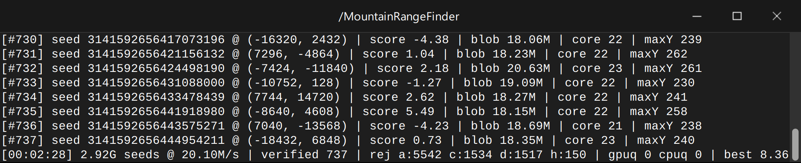
</p>

<p align="center" style="color: #aaaaaa;"><i>A sample run in a terminal</i></p>

Each verified seed is ranked using a custom-built, configurable scoring system that separates mediocre regions from spectacular ones. This system looks at nearly 100 different factors like total area, mountain peak prominence, valley-network density, steepness, and even adjacent features like warm oceans, fjords, isthmuses, and mushroom islands. There's nothing like a beautiful mountain region with beautiful surroundings!

## Table of Contents

||
|-|
|**- [System Requirements](#system-requirements)**|
|**- [Quick Start](#quick-start)**|
|**- [Useful Commands](#useful-commands)**|
|**- [Reading an Output File](#reading-an-output-file)**|
|**- [Recalibrating the Scoring System](#how-to-recalibrate-the-scoring-system)**|
|**- [Manual Build Guide](#manual-build-guide)**|
|**- [Project Tree](#project-tree)**|
|**- [FAQ](#faq)**|
|**- [How It Works](#how-it-works)**|
|**- [License & Acknowledgements](#license--acknowledgements)**|


## System Requirements

|Component|Recommended Specs|
|-|-|
|**GPU**|Nvidia RTX 30-series or newer; 1.5 GiB VRAM minimum, 2.5 GiB for full speed. Older Turing cards (RTX 20xx / GTX 16xx) work with one extra compile flag ~ see [Manual Build Guide](#manual-build-guide).|
|**GPU Driver**|Any recent Nvidia driver; the CUDA toolkit is only needed if manually building.|
|**CPU**|Multi-core|
|**RAM**|≥ 500 MB|
|**OS**|Linux; Windows 10/11|


## Quick Start

1. Visit the [Releases](https://github.com/Daveofthecave/MountainRangeFinder/releases) page, scroll down to the Assets section, and download the Linux binary (`mountain_rangefinder`) or the Windows .exe (`mountain_rangefinder.exe`), depending on your operating system. If you want, you can move the file into its own standalone folder.

    <details style="color: #aaaaaa;">
    <summary id="verify-checksum">Optional: How to verify the checksum (click to expand)<br></br></summary>

    <dl><dd>

    **Motivation**: A downloaded executable can be tampered with or corrupted in transit. To rule this out, we can use something called a **checksum**. A checksum is a short fingerprint of 64 hexadecimal characters computed from a file's exact bytes. The checksums of two bit-identical files will be identical. But if you change even a single bit in one of the files, now their two checksums will differ significantly. **SHA-256** is the industry-standard fingerprint recipe. Since MRF's release page publishes the fingerprint of the file that was uploaded, you can recompute the fingerprint of the file you downloaded and compare the two. Matching fingerprints means, barring an astronomically unlikely coincidence, identical files. If you generate the executable's hash value on your system, and find that it differs from the hash value published in `SHA256SUMS.txt`, then it's safer not to run that executable. In that case, you can try re-downloading (and re-checking) it, or you can manually [build it yourself](#manual-build-guide) from the files in this repo.

    To verify a checksum:

    - On , open a terminal in the folder containing both the binary and `SHA256SUMS.txt` (downloaded from the releases page), and run:

        ```sh
        sha256sum -c --ignore-missing SHA256SUMS.txt
        ```

        If the command prints `mountain_rangefinder: OK`, then your download matches the published build bit for bit, and you're good to go! (The `--ignore-missing` flag just tells it to skip the Windows binary's line, since you didn't download that one.) If it reports a mismatch, then don't run the executable; try re-downloading (and re-checking) it, or building it manually.

    - On , open up a PowerShell window, and run:

        ```powershell
        (Get-FileHash .\mountain_rangefinder.exe).Hash
        ```

        The printed hash should match the one published in the release notes (`SHA256SUMS.txt`). Open it in Notepad to compare; case doesn't matter.

    </dd></dl>

    </details>

2. Open a terminal/CMD window in the folder containing the executable file you downloaded:
    - : In your file explorer, right-click an empty space in the directory containing the executable you downloaded, and then click `Open in Terminal` to launch a terminal at that address. Or just whip up a random terminal and type `cd /path/to/MountainRangeFinder` (be sure to provide the correct directory address).
        <p align="left">
            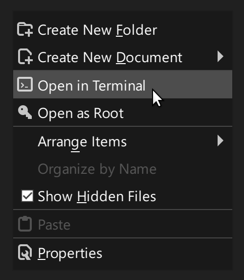
        </p>
        Additionally, give the downloaded file permission to run with this one-time command:

        ```sh
        chmod +x mountain_rangefinder
        ```
    - : In File Explorer, navigate to the folder containing the `mountain_rangefinder.exe` file, type `cmd` in the address bar, and hit Enter to launch a Command Prompt window at the folder's address.

        <p align="left">
            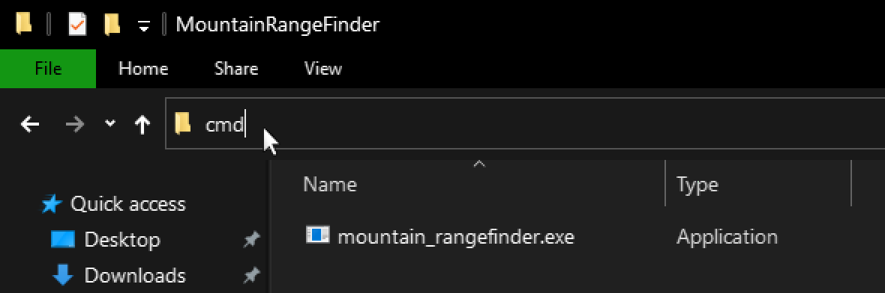
        </p>

3. To run a default seedfinding session with MRF, simply type `./mountain_rangefinder` if you're on Linux, or `mountain_rangefinder.exe` if you're using Windows, and the program will start finding mountainous megaregions while writing the results into `output.txt`.
4. To terminate the search, press `CTRL+C` on your keyboard.
5. To review the seeds MRF found, you can always eyeball them in [Cubiomes Viewer](https://github.com/Cubitect/cubiomes-viewer) (CV). Use [this](#copy-to-clipboard) command to copy the sorted seedlist to your clipboard, after which you can paste it (`CTRL+V`) into CV. Then you can download this complementary [.session](Cubiomes_Viewer_MountainRangeFinder_seed_verifier_v3.session) file from this repository (tested on CV 4.1.x), load it into CV (`CTRL+O`), click on the `Locations` tab (under the `Search` tab), click the `Analyze` button, expand the dropdown under the seed you want to review, and click on `Spiral Iterator` to automatically reposition the map to the approximate coordinates where the mountainous megaregion lives. (The video clip below guides you through this process:)

<p align="center">https://github.com/user-attachments/assets/e9f956ef-f9ef-4860-a670-06146788da9e</p>

<p align="center" style="color: #aaaaaa;"><i>Examining a region in Cubiomes Viewer</i></p>


## Useful Commands

Below is a list of sample commands you can copy and paste into your terminal/CMD, along with explanations of what they do. By all means, you can mix and match your `--flags` as you please; this is just a quick reference guide for convenience.

The following commands work natively on Linux; if you're on Windows, simply replace the `./mountain_rangefinder` prefix with `mountain_rangefinder.exe`; everything else stays the same.

- The baseline search command; MRF selects a random seed, and starts a brute-force search in numerical order across a subset of the 2<sup>64</sup> seed space using the default settings:
    >`./mountain_rangefinder`

- To start on a specific seed, use the --start flag:
    >`./mountain_rangefinder --start 3141592653589793238`

- To search through seeds in a randomized order, use the --shuffled-search flag:
    >`./mountain_rangefinder --shuffled-search`

- To specify the name of the output file to which you want the discovered seeds to be written, use the --output flag:
    >`./mountain_rangefinder --output cool_seeds.txt`

- If you have an existing file of seeds you want to search, use the --seeds flag:
    >`./mountain_rangefinder --seeds seedlist.txt`

- To specify the minimum size the mountainous megaregion has to be (i.e. the total area of the low-erosion blob), use the --min-blob-area flag with your desired value. The default is 18 million blocks², assuming --ero-max is set to the default of -0.35. Mountain regions can exceed 25 or 30 million blocks², but those are rarer. If you tighten the --ero-max threshold (eg. by lowering the maximum erosion to -0.45), this will lower the average reported size of the --min-blob-area, so bear that in mind if the flow of candidates suddenly shrinks.
    >`./mountain_rangefinder --min-blob-area 20000000`

- Many mountainous megaregions exist as narrow spaghetti strips winding for many thousands of blocks. If you want to guarantee that a robust mountainous core exists in the megaregion (essentially a circular area within the mountain region that is comprised exclusively of mountainous terrain), you can use the --min-core-width flag to specify the minimum radius of this core. This can help you find large bloblike regions, and filter out the long, thin mountain noodles at the cost of results/hour. Values are multiplied by 64, so if you want a radius of at least 1,472, for example, your core radius would be 1,472 ÷ 64 = 23. The default is 20.
    >`./mountain_rangefinder --min-core-width 23`

- To exclude seeds with low scores (which generally have rather underwhelming mountainous terrain), use the --min-score flag. Generally speaking, ugly regions have a negative score, mediocre regions have a low positive score, and good regions with a lot of tall mountain peaks have a score of 6 or more.
    >`./mountain_rangefinder --min-score 6`

- Taller peaks tend to contribute to higher scores on average; if you want to find a region with peaks in a certain height range, use --min-height and --max-height. To force only the tallest peaks (which cap out at Y = 256, but can be un-capped using a really cool lightweight datapack I recommend called [Mountain Peaks](https://modrinth.com/datapack/peaks)), use something like this:
    >`./mountain_rangefinder --min-height 250 --max-height 320`

- To tune the climate noise parameter thresholds, tweak the flags below.

    >`--ero-max` (default `-0.35`) determines the maximum allowable erosion a mountain region can have. Mountainous zones love low erosion, so keep this value negative.
    >
    >`--cont-min` (default `-0.12`) determines how inland the region has to be; very negative values allow for big oceans to take up space, while very positive values push oceans to the side. The default value is a happy medium which tolerates some oceans and ocean lakes, without being too oceanic.
    >
    >`--temp-range` (default `-0.45 0.20`) - Values under -0.45 allow frozen biomes to count; values between the default values feature temperate zones; and values above 0.20 allow for hotter biomes like savannas, stony peaks, and badlands.

- <span id="dark-forest-filter"></span>Because I'm not a fan of dark forests (they are magnets for mobs, which like to spawn there even during daylight), MRF by default kicks out any region whose core disc (a 1,365-block-radius circle around the candidate's anchor) is 7% or more dark forest. That being said, if you don't mind dark forests taking up more space in the mountainous region, you can turn off the filter like this:
    >`./mountain_rangefinder --no-dark-forest`

- To print the seeds from an output seedlist into the terminal, use --list-seeds:
    >`./mountain_rangefinder --list-seeds output.txt`

    Optionally, if you want MRF to pre-sort the seeds from an output seedlist before printing, combine --list-seeds with --sort, and specify what you want to sort by; eg. to sort by score:
    >`./mountain_rangefinder --list-seeds output.txt --sort score`

    <div style="margin-left: 2em;">

    <span id="copy-to-clipboard"></span>
    What's cool is that you can pipe this command to a clipboard utility, which will copy the sorted seedlist to your clipboard, and then you can paste the whole thing into Cubiomes Viewer!
    
    **Linux X11:** 
    >`./mountain_rangefinder --list-seeds output.txt --sort score | xclip -selection clipboard`
    
    **Linux Wayland:**
    >`./mountain_rangefinder --list-seeds output.txt --sort score | wl-copy`

    <details style="color: #aaaaaa;"> 
    <summary>Note</summary>

    If your terminal complains that xclip or wl-copy was not found, you can always install them with these commands:
    
    - Ubuntu/Debian:

        `sudo apt install xclip`

        `sudo apt install wl-clipboard`

    - Fedora:
    
        `sudo dnf install xclip`

        `sudo dnf install wl-clipboard`

    - Arch:

        `sudo pacman -S xclip`

        `sudo pacman -S wl-clipboard`

    </details>
    <br>

    **Windows:**
    >`mountain_rangefinder.exe --list-seeds output.txt --sort score | clip`

    </div>

- <span id="verify-seedlist-command"></span>If you have an `output.txt`-type file with seeds from a previous session you ran using different parameters, and you want to re-evaluate/re-score the seedlist using a set of different parameters, you can use the --verify flag. This may be useful, for example, after [recalibrating the score](#how-to-recalibrate-the-scoring-system), where your weights have changed, or perhaps when your previous run had very loose search parameters, and you want to re-check all the candidates to see if they match a tighter set of parameters.
    >`./mountain_rangefinder --verify output.txt --output output_reverified.txt`

    <div style="margin-left: 2em;">
    <details style="color: #aaaaaa;"> 
    <summary>Note</summary>

    If your `output.txt` contains seeds that were found using a looser set of parameters (eg. lower minimum Erosion, narrower core blob width, smaller minimum area), it may happen that when the `--verify` command checks them, some of them may not pass the default criteria. If that happens, you can always try verifying them by opening the gates, so that every seed has a chance to pass through; try something like:

    `./mountain_rangefinder --verify output.txt --output output_verified.txt --no-height --no-dark-forest --min-core-width 0 --min-blob-area 1000000`

    </details>
    
    </div>

- When you're bulk re-scoring a really big seed file and you value speed over the most accurate scores, --phases 1 tells MRF to measure each megaregion on a single sampling grid instead of four overlapping ones. It runs about 4x faster, at the cost of slightly less precise scores (the grids get their explanation in the [scoring section](#phases-explanation)):
    >`./mountain_rangefinder --verify output.txt --output output_fastpass.txt --phases 1`

- To measure candidates with every gate wide open, where nothing gets rejected, and each row gets the full enrichment bundle, use --probe:
    >`./mountain_rangefinder --probe candidates.txt --output probe_results.txt`

- To render a small rudimentary map thumbnail of each verified region into a folder (useful for a quick check if you don't want to bother examining regions in Cubiomes Viewer), you can use the --thumbs flag, along with --thumb-min-score, which lets you set the minimum region score for which you'd want a thumbnail to generate, to avoid flooding the folder with thousands of mediocre thumbnails:
    >`./mountain_rangefinder --verify output.txt --thumbs thumbs/ --thumb-min-score 6 --output output_scored.txt`


- For the full list of commands, type:
    >`./mountain_rangefinder --help`


## Reading an Output File

Each verified megaregion gets one row in `output.txt`, appended procedurally while the search runs (so you can peek at it without stopping anything). The file's own header comment lists every column name; here's how to read the key ones:

|Column|What It Tells You|
|-|-|
|`score`|How spectacular the megaregion is. Higher is better; sort by this column descending to see MRF's best finds first. Negative values correspond to underwhelming megaregions.|
|`seed`|The 64-bit seed. Paste it into Cubiomes Viewer or straight into Minecraft.|
|`x z`|The coordinates pointing to the megaregion's best area. This is the spot to teleport to.|
|`blobAreaBlocks2`|The size of the megaregion in blocks². 18M is the default gate; 25M+ is hefty; 30M+ is a monster (assuming default settings).|
|`coreRadiusCells`|The radius of the largest mountainous circle that fits entirely inside the megaregion, in 64-block cells (multiply by 64 for blocks).|
|`maxY`|The tallest approximate terrain sample found near the core region.|
|`edgeClipped`|1 means the blob ran off the CPU's ±48,000-block measurement window, so its area is a lower bound.|
|`anchorX` / `anchorZ`|The original coordinates where the pipeline first detected this megaregion. `--verify` reproduces the original verdict from these.|
|`bio*`|Percentages of various biome groups taking up the megaregion: (mountains, old-growth taiga, taiga, meadow, cherry grove, dark forest, plains, rivers, ocean). The number is formatted as a fraction (eg. 0.03 = 3%).|
|`bw1664*`|Stats of the best 1,664-block mountain-pattern window: `Sc` = pattern score; `Dh` = steepness; `hStd` = height spread; `Hi`/`Lo` = high-ground and valley-floor shares; `Mtn` = mountain cover; `Dark` = dark-forest share.|
|`setting`|The scenery bonus (fjords, cliffs, river lakes, oddball biomes nearby), capped at +0.80.|

A few conventions worth knowing:

- `-999.99` (or `-999`) means "not measured" for that row, so old and new files can be mixed without breaking the parsers.
- Climate columns are in raw noise units; multiply by 10,000 to compare against Cubiomes Viewer's climate displays.
- Scores are only comparable within the same calibration. If you recalibrate, run `--verify` on an old file to re-score it under the new weights ([sample command](#verify-seedlist-command)).
- The output file is append-only and resumable; restarting MRF with the same `--output` file reloads it, so a resumed search does not overwrite existing rows, and never reports the same point twice.

For a comprehensive overview of all 95 variables that contribute to a seed's score and provide diagnostic measurements (many of which are listed in the `output.txt` header), visit the dropdown subsection called [Score Reference Tables](#score-reference-tables).


## How to Recalibrate the Scoring System

If the current top-scoring mountainous regions don't fit your vibe, you can always recalibrate the weights of the scoring system to teach it to prioritize what you like. You may prefer your core mountain regions to feature huge massifs, wider valleys, or rivers criss-crossing between peaks. MRF lets you re-define what patterns get scored high, and which ones get pushed to the side.

A quick heads-up before you dive in: this is a rather advanced procedure. Recalibrating means editing the source code and rebuilding the program, so you'll need to download/clone this repository and set up a build environment, both of which are covered in the [Manual Build Guide](#manual-build-guide) section. If all you want is cool seeds, feel free to skip this section entirely; the default calibration is quite competent.

To recalibrate, follow this procedure:

1. Grab one of your `output.txt` verified seed files after a long run, or combine several of these files into a master file (`consolidate_seedlists.py` is your friend ~ expand "[Can I run two searches at once?](#how-to-consolidate-seedlists)" for a sample command). Make sure the master file has several thousand (or, better yet, tens of thousands of) seeds. The richer the corpus, the more accurate the tuning.

2. Run this command to re-verify the seeds with standardized parameters:

    ```sh
    ./mountain_rangefinder --verify output.txt --output output_verified.txt
    ```

    <details style="color: #aaaaaa;"> 
    <summary>Note</summary>

    <div style="margin-left: 2em;">

    If your `output.txt` contains seeds that were found using a looser set of parameters (eg. lower minimum Erosion, narrower core blob width, smaller minimum area), it may happen that when the `--verify` command checks them, some of them may not pass the default criteria. If that happens, you can always try verifying them by opening the gates, so that every seed has a chance to pass through; try something like:

    ```sh
    ./mountain_rangefinder --verify output.txt --output output_verified.txt --no-height --no-dark-forest --min-core-width 0 --min-blob-area 1000000
    ```

    </div>

    </details>


3. We now need to generate a CSV spreadsheet called `todo.csv` that will contain a selection of 150 seeds from `output_verified.txt`. In the following steps, you will use this spreadsheet to rank which seeds you like and which ones you dislike. Generate it with this command:

    ```python
    python3 seedlab.py recal output_verified.txt --todo 150 --out todo.csv
    ```

    <details style="color: #aaaaaa;"> 
    <summary>Troubleshooting</summary>

    <div style="margin-left: 2em;">

    This assumes you have `python3` installed on your **Linux** system (it usually comes pre-installed). If you don't, you can use one of these commands to install it first:

    - Ubuntu/Debian:

        ```sh
        sudo apt install python3
        ```

    - Fedora:
    
        ```sh
        sudo dnf install python3
        ```

    - Arch:

        ```sh
        sudo pacman -S python
        ```

    If you're on **Windows**, and your Command Prompt window complains, then try replacing `python3` with just `python`.

    If it complains that `python` was not found, then install it from [python.org](https://www.python.org/downloads/) first. Tick the "Add python.exe to PATH" checkbox in the installer, click through the wizard, close and reopen your terminal, and try running the `python seedlab.py recal output_verified.txt --todo 150 --out todo.csv` command again.

    </div>

    </details>

4. Open `todo.csv` in a spreadsheet viewer like [LibreOffice Calc](https://www.libreoffice.org/download/), [Microsoft Excel](https://www.microsoft.com/en-us/microsoft-365/excel), or another utility.

5. Copy the **seed** column into Cubiomes Viewer's `Seeds` tab, load the complementary [.session](Cubiomes_Viewer_MountainRangeFinder_seed_verifier_v3.session) file from this repo, switch to the `Locations` tab, click the `Analyze` button, then the `Expand All` button, and examine the mountainous region by clicking the `Spiral Iterator` associated with the seed you want to analyze.

6. Find the **label** column in `todo.csv`, and, after eyeballing a seed, give its **label** rating a `1` if you like the megaregion, or `0` if you're not a fan. Try to label at least 20 `1`s.

7. After you ranked every seed in `todo.csv` with a `1` or `0` in the **label** column based on how you liked their mountain regions in Cubiomes Viewer, delete the **x**, **z**, and **oldscore** columns, and then delete the header row. Then, save the file (making sure you keep it a CSV) and exit out of your spreadsheet editor. If this is your first calibration pass, rename `todo.csv` to `labels.csv`; if you already have a `labels.csv` from an earlier round, append the new rows to it instead, so the fit keeps learning from everything you've ever labeled.

8. Now, using your new spreadsheet of preferences, generate a new set of weights with this command:

    ```python
    python3 seedlab.py recal output_verified.txt --labels labels.csv
    ```

    The new weights will be used to recalibrate the scoring system to better fit your tastes, according to `labels.csv`.

9. The seedlab script will chew through your seed file, and then will spit out a summary of which score attributes influence your taste the most. Find the `const Term terms[] = {` block in the middle of seedlab's output, select it all the way down to the `};`, and copy it. Then, find the file in your downloaded repo called `probe.cpp`, and open it in a text editor or IDE. Then, search for the function starting with `double compute_score` (you can use `CTRL+F` to find that string sequence -- it only occurs once), and then scroll down to the block that starts with `const Term terms[] = {`. Select the whole block, all the way down including the `};`, and paste the new block in to replace the old values.

    The script `seedlab.py` carries its own mirror of the Term table (the `LEGACY` list near the top), which it uses to double-check scores. The recalibration output is written in C++, so the script ships a tiny converter to convert it to Python. Save the generated `const Term terms[] = { ... };` block to a file (say, `terms.txt`) in the same directory where `seedlab.py` appears, and then run:

    ```python
    python3 seedlab.py cxx2py < terms.txt
    ```

    The converter prints the Python version of the table; paste that over the `LEGACY` list in `seedlab.py`. Once you've rebuilt (next step), `python3 seedlab.py check <a freshly verified file>` should report a mirror drift of ~0.00, which is your proof that the Python script agrees with the compiled C++ code.

10. Rebuild MountainRangeFinder using this command:

    ```sh
    make clean && make -j$(nproc) && make test && make recall
    ```

    Verify that the test passes and the selftest gives the "magic seed" a score.

11. After the program finishes compiling, re-run this command on `output_verified.txt` to re-score it using your newly-tuned weights:

    ```sh
    ./mountain_rangefinder --verify output_verified.txt --output output_reverified.txt
    ```

12. You can now examine the newly-scored seeds by following Step 5 from the [Quick Start](#quick-start) section. If you're not happy with the top 100 seeds, and think that seeds that ranked lower fit your tastes more often, try recalibrating again by going up to Step 3 of this guide. Alternatively, you can always try generating a new `output.txt` file with a different set of seeds, and then using that as your baseline.


## Manual Build Guide

MountainRangeFinder lets you compile your own executable file from the source files in this repo. Why bother doing so when there's already a [release binary](https://github.com/Daveofthecave/MountainRangeFinder/releases)?

- It can squeeze a little extra speed out of your exact hardware (native code for your GPU instead of generic bytecode), though in practice the difference is minor.
- You get access to the latest tweaks before they land in a release.
- It's one of the steps in [recalibrating the scoring system](#how-to-recalibrate-the-scoring-system), essentially re-teaching the system to reward mountain regions that fit _your_ unique taste. 
- If the release binary refuses to run on your machine (eg. if you have an older GPU or an unusual distro), building from source will make MRF run on your particular setup.
- And if you like knowing exactly what code goes into the programs you run, nothing beats building them yourself.


|What you'll need|
|:-|
|- A C/C++ compiler toolchain (`gcc`, `g++`, `make`)|
|- The **NVIDIA CUDA Toolkit** (for `nvcc`; anything from the last few years is fine)|
|- **CMake** 3.24 or newer (required on Windows; a nice-to-have on Linux)|
|- `git`, if you'd rather clone than download the ZIP (optional)|
|- Python 3 with NumPy and Pillow, if you ever want to regenerate the explainer GIFs in `viz/` (optional)|


1. Download and extract this repository to a folder on your PC.

    You can use this link (which you can also find by clicking the green `Code` button at the top of this page, and clicking `Download ZIP`):

    - https://github.com/Daveofthecave/MountainRangeFinder/archive/refs/heads/main.zip

    Alternatively, if you have `git` installed on your system, you can open a terminal in the directory where you want to run MRF, and type this command to clone the repo:

    - ```sh
      git clone https://github.com/Daveofthecave/MountainRangeFinder.git
      ```

2. Refer to the following platform-specific instructions:

    - ### 

        1. Open a terminal in the folder where you extracted the repository (right-click an empty spot in your file manager and choose "Open in Terminal", or `cd` there yourself).
        2. Install the compiler toolchain and the CUDA toolkit:
            - **Ubuntu/Debian:**

                ```sh
                sudo apt update
                sudo apt install build-essential nvidia-cuda-toolkit git
                ```

                If your distro's CUDA package is old or missing, use [NVIDIA's own CUDA repository](https://developer.nvidia.com/cuda-downloads): pick Linux, then your distro and version, and run the commands it lists.
            - **Fedora:**

                ```sh
                sudo dnf install gcc gcc-c++ make git
                ```

                Fedora's own repos don't carry the full CUDA toolkit, so grab it from [NVIDIA's download page](https://developer.nvidia.com/cuda-downloads) (choose Linux → Fedora → your version, and follow the commands it lists).
            - **Arch:**

                ```sh
                sudo pacman -S base-devel cuda git
                ```
        3. Type this command to check if the CUDA compiler installed properly: 
        
            ```sh
            nvcc --version
            ```
                
            You should see a banner that starts with "Cuda compilation tools, release 12.x" (the exact number doesn't matter). If the terminal says the command wasn't found, the toolkit installed itself somewhere your shell doesn't look. NVIDIA's installer uses `/usr/local/cuda/bin`, while Debian/Ubuntu's package sometimes hides in `/usr/lib/cuda/bin`, so try both:

            ```sh
            export PATH=/usr/local/cuda/bin:/usr/lib/cuda/bin:$PATH
            nvcc --version
            ```

            Once the banner shows up, you can add that same `export` line to the end of your `~/.bashrc` so every future terminal knows where to look (optional).
        4. Build and test by running this command from the project root:

            ```sh
            make clean && make -j$(nproc) && make test && make recall
            ```

            Keep an eye out for `PASS` from the selftest and `RECALL OK` from the recall test.
        5. Your fresh binary is `./mountain_rangefinder`. Try running 
        
            ```sh
            ./mountain_rangefinder --help
            ```
            
            to see everything it can do.

        Useful variations:

        - **Turing cards (RTX 20xx / GTX 16xx):** add `-gencode arch=compute_75,code=sm_75` to `NVCCFLAGS` in the Makefile, then rebuild.
        - `make release` builds a portable binary (static CUDA runtime, static libstdc++/libgcc). Build it on the OLDEST distro you intend to support, and the result runs anywhere newer.
        - `make FM=1` enables fast math on the GPU path as an experiment; run `make test` afterwards to confirm the tolerance still holds.
        - **Prefer CMake on Linux too?** `cmake -B build && cmake --build build -j$(nproc) && ctest --test-dir build` does the same job as `make` + `make test`; the binary lands in `build/mountain_rangefinder`. (If `cmake` isn't found, run `sudo apt install cmake`, or your distro's equivalent.)
        - To regenerate the explainer GIFs, run `make vizshim` once, then `viz/render_all.sh`.

    - ### 

        Building on Windows is the scenic route, because `nvcc` insists on using Microsoft's compiler. The good news is that CMake wrangles both compilers for you, so the actual build is two commands. If you're still up for it:

        1. Install [Visual Studio Community 2022](https://aka.ms/vs/17/release/vs_community.exe). In the installer, tick the "Desktop development with C++" workload, and on the right-hand panel make sure "MSVC v143", a Windows SDK, and "C++ CMake tools for Windows" are all checked. (If you'd rather skip installing the entire IDE, the [Build Tools for Visual Studio](https://aka.ms/vs/17/release/vs_buildtools.exe) (~6.7GB) give you the same compiler.)

        2. Install the **CUDA Toolkit** (~3.5GB) from [NVIDIA's download page](https://developer.nvidia.com/cuda-downloads): pick Windows, your architecture (usually x86_64), your version, and the "exe (local)" installer. The defaults are fine, and the installer registers CUDA with Visual Studio by itself.

            <details style="color: #aaaaaa;">
            <summary>Already had the CUDA Toolkit installed before Visual Studio?</summary>

            <dd>

            That registration only reaches the Visual Studio versions that exist *at the moment CUDA is installed*. If your toolkit predates your existing Visual Studio (say, CUDA was already on the machine from an older project), the integration files never made it across, and the `cmake` step fails with `No CUDA toolset found`. Copy them over by hand, from an **administrator** Command Prompt:

            ```cmd
            copy "C:\Program Files\NVIDIA GPU Computing Toolkit\CUDA\v<your version>\extras\visual_studio_integration\MSBuildExtensions\*" "C:\Program Files\Microsoft Visual Studio\2022\Community\MSBuild\Microsoft\VC\v170\BuildCustomizations\"
            ```

            (If you installed the Build Tools rather than the full Visual Studio, the destination lives under `C:\Program Files (x86)\Microsoft Visual Studio\2022\BuildTools\...` instead. Re-running the CUDA installer's repair does the same job, but the copy is faster.)

            An older toolkit can also clash with a newer MSVC, since nvcc compiles its host code against the Visual Studio standard library, and the newest toolsets refuse it outright: the `cmake` step dies with `error STL1002: Unexpected compiler version, expected CUDA 12.4 or newer` (on some setups, nvcc instead complains about an unsupported Visual Studio version). The remedy is to hand nvcc a compiler from its own era: open the Visual Studio Installer, Modify, Individual Components, tick an older **MSVC v143 build tools** component (eg. v14.35; the oldest offered is the safest), then add `-T version=<that version>` to the `cmake` configure line in step 4 below, so the build actually uses it.

            </dd>
            </details>

            <p></p>

        3. Open the Start Menu and launch "x64 Native Tools Command Prompt for VS 2022". This is a special **Command Prompt** window with the compiler environment pre-loaded; a plain PowerShell window won't know where the `cl.exe` compiler lives. In that prompt, `cd` into the project folder you downloaded/cloned earlier:

            ```cmd
            cd C:\path\to\MountainRangeFinder
            ```
        4. Configure the build by running this command:

            ```cmd
            cmake -B build -G "Visual Studio 17 2022" -A x64
            ```

            If `cmake` isn't recognized, either Visual Studio's bundled CMake didn't make it onto the PATH (re-run the VS installer and check "C++ CMake tools for Windows"), or grab the installer from [cmake.org](https://cmake.org/download/), then close and reopen the prompt.
        5. Compile MountainRangeFinder:

            ```cmd
            cmake --build build --config Release
            ```
        6. Your fresh binary gets put in `build\Release\mountain_rangefinder.exe`. Try running
        
            ```cmd
            .\build\Release\mountain_rangefinder.exe --help
            ```
        
            to see if the program works (you should see it output a list of --flags).
        7. Run the bundled tests. The command
        
            ```cmd
            ctest --test-dir build -C Release
            ```
            
            runs the numeric selftest (look for `PASS`).
            
            For the end-to-end recall test, run 
            
            ```cmd
            .\build\Release\mountain_rangefinder.exe --seeds test_seeds.txt --output recall_test.txt
            ```
            
            and then open `recall_test.txt`. If it has at least one line that doesn't start with `#`, the pipeline just rediscovered the known megaregion seed and everything works.

        The alternative that skips Visual Studio entirely is Windows Subsystem for Linux 2 (**WSL2**). Install "Ubuntu" from the Microsoft Store, make sure your Windows NVIDIA driver is reasonably current (WSL2 shares the Windows driver, so you don't install one inside WSL), then open the Ubuntu window and follow the Linux instructions above. CUDA runs at full speed there.


## Project Tree

<details>
<summary><b>MountainRangeFinder/</b>   <-- Click to browse the repo</summary>

- <details>
  <summary><b>cubiomes/</b> -- the biome generation library by Cubitect</summary>

  The reference implementation of Minecraft's world-generation math, in its full form. The CPU verifier, the prober, and the self-test all sample real Minecraft fields and biomes through it, and the GPU's float pipeline is continuously checked against it for agreement.

  - [`biomenoise.c`](cubiomes/biomenoise.c) / [`biomenoise.h`](cubiomes/biomenoise.h) -- The 1.18+ climate engine: the five noise maps, the depth spline that turns them into approximate terrain height, and the biome decision trees that translate climate into biomes. Nearly every CPU-side measurement MRF makes flows through here.
  - [`biomes.c`](cubiomes/biomes.c) / [`biomes.h`](cubiomes/biomes.h) -- The biome roster: numeric IDs, which Minecraft versions each biome appears in, and classification helpers like "is this an ocean". MRF's nine census bins (mountains, old-growth taiga, dark forest, rivers, and friends) are defined in terms of these.
  - [`generator.c`](cubiomes/generator.c) / [`generator.h`](cubiomes/generator.h) -- The Generator object ties a seed, a version, and a dimension into one queryable whole. The verifier's getBiomeAt() and mapApproxHeight() calls live here, the workhorses behind the dark-forest check, the height gate, and the enrichment census.
  - [`noise.c`](cubiomes/noise.c) / [`noise.h`](cubiomes/noise.h) -- The raw noise primitives (Perlin, octave stacking, double-Perlin) that the climate fields are built from. You rarely touch it directly, but everything in biomenoise.c stands on it.
  - [`rng.h`](cubiomes/rng.h) -- Minecraft's random number generators (the Java LCG and Xoroshiro128++), plus the seed-mixing helpers that turn a world seed into per-octave noise seeds. A small file with big influence.
  - [`finders.c`](cubiomes/finders.c) / [`finders.h`](cubiomes/finders.h) -- Structure placement math: villages, strongholds, monuments, and friends. MRF hunts terrain rather than structures, so it never calls into these, but Cubiomes Viewer leans on them when you go sightseeing in the megaregions you found.
  - [`quadbase.c`](cubiomes/quadbase.c) / [`quadbase.h`](cubiomes/quadbase.h) -- Helpers for finding tightly packed quad-structures (witch-hut and monument farm territory). MRF doesn't use them; they're kept so the bundled copy stays a complete, drop-in cubiomes.
  - [`layers.c`](cubiomes/layers.c) / [`layers.h`](cubiomes/layers.h) -- The legacy pre-1.18 biome layer stack. MRF only ever runs 1.18+, but keeping this around means the bundled cubiomes still works for older worlds.
  - [`util.c`](cubiomes/util.c) / [`util.h`](cubiomes/util.h) -- Assorted small utilities, including the str2mc()/mc2str() converters behind the --mc flag and the version banner at startup.
  - [`tables/`](cubiomes/tables) -- The per-version biome decision trees (btree18 through btree21wd) that getBiomeAt() consults. The Winter Drop tree in here is what lets --mc accept 1.21.4-era worlds.
  - [`docs/`](cubiomes/docs) -- Upstream's design notes and layer diagrams. A good read if you're curious how biome generation worked before the 1.18 noise overhaul.
  - [`tests.c`](cubiomes/tests.c) -- Upstream's own test harness, excluded from MRF's build because it brings its own main().
  - [`LICENSE`](cubiomes/LICENSE) -- cubiomes' MIT license.
  - [`README.md`](cubiomes/README.md) -- Upstream's own README, with examples of the library beyond the corners MRF uses (structure finders, quad-hut searches, older-version generation).
  - [`makefile`](cubiomes/makefile) / [`CMakeLists.txt`](cubiomes/CMakeLists.txt) -- cubiomes' standalone build files. MRF compiles the .c files straight into its own binary and never invokes these, but they're kept so the folder still builds on its own.
  </details>
- <details>
  <summary><b>seedlists/</b> -- where you go if you want to combine multiple seedlists into one</summary>

  - [`consolidate_seedlists.py`](seedlists/consolidate_seedlists.py) -- Merges any number of seedlists (eg. plain seed-per-line files, MRF output rows, Cubiomes Viewer exports) into one deduplicated master file, normalizing signed and unsigned spellings of the same seed along the way. Handy before a big --seeds run, or for assembling every seedlist you've ever kept into one recall atlas.
  </details>
- <details>
  <summary><b>viz/</b> -- the explainer-GIF pipeline</summary>

  The GIFs in How It Works are rendered by these scripts rather than drawn by hand: each one samples the real climate fields of a real seed through cubiomes, so the pictures track the code's actual behavior.

  - [`make_g00_preamble.py`](viz/make_g00_preamble.py) through [`make_g12_constellation.py`](viz/make_g12_constellation.py) -- One script per GIF, in pipeline order: the climate fields, the octave ladder, the anchor lattice, the seven-point probe, the sunflower disc, the window checks, the flood fill, the dark-forest veto, the CPU gates, the pattern windows, the score waterfall, the funnel, and the constellation of finds.
  - [`style.py`](viz/style.py) -- The shared palette, fonts, pacing, and the little pipeline-progress rail running down the side of every frame, so the whole set reads as one explainer rather than thirteen separate demos.
  - [`geom.py`](viz/geom.py) -- The anchor-lattice geometry (hex grid, phyllotaxis disc pattern) shared by the scripts, mirroring the constants in gpu.cu so the animations match the real search layout.
  - [`fields.py`](viz/fields.py) -- Helpers that sample climate fields, biome maps, and approximate heights through a small C shim (a thin wrapper that lets Python call into the cubiomes C code), caching results as .npy files in viz/cache/ so re-renders take less time.
  - [`vizshim.c`](viz/vizshim.c) -- A tiny C wrapper around cubiomes, exposing a plain C ABI (the stable calling convention Python's ctypes can talk to) so the scripts sample the real climate fields instead of lookalike approximations. `make vizshim` builds it into viz/libmrfshim.so.
  - [`CONSTANTS.md`](viz/CONSTANTS.md) -- The provenance table recording which code constant each GIF quotes, so you know exactly which scripts to re-render after a tuning change.
  - [`render_all.sh`](viz/render_all.sh) -- Renders every GIF in one go.
  - [`out/`](viz/out) -- The rendered GIFs. They're committed intentionally, since the README embeds them.
  - [`etc/`](viz/etc) -- Visuals like the main banner, the terminal screenshot, and the Cubiomes Viewer usage clip.
  </details>
- [`.gitignore`](.gitignore) -- The keep-out list: build artifacts, search output, the viz caches, and other regenerable files stay out of the repo.
- [`CMakeLists.txt`](CMakeLists.txt) -- The portable build recipe, so Windows (MSVC + nvcc) and IDEs can build the project without Makefile gymnastics.
- [`common.h`](common.h) -- The shared rulebook: the search square's size, the climate thresholds that define what counts as mountainous, the minimum region size and core width, and the message structs the GPU and CPU threads pass between each other. To retune the search's geometry, start here.
- [`cpu.cpp`](cpu.cpp) / [`cpu.h`](cpu.h) -- The CPU verifier. Candidates that survived the GPU get their final exams here: the dark-forest veto, the double-precision re-measurement of the region's area and core radius, and the approximate-height window. Only after all three pass does a megaregion earn its row in the output file.
- [`Cubiomes_Viewer_MountainRangeFinder_seed_verifier_v3.session`](Cubiomes_Viewer_MountainRangeFinder_seed_verifier_v3.session) -- The complementary Cubiomes Viewer session. Load it in CV, paste in seeds MRF found, hit Analyze on the Locations tab, and clicking a seed's Spiral Iterator entry flies the map straight to its megaregion.
- [`gpu.cu`](gpu.cu) / [`gpu.h`](gpu.h) -- The GPU CUDA pipeline with 5 custom kernels: noise-table init, the anchor-lattice coverage probe, late table init, the windowed extrema checks, and the flood fill that measures a candidate region's true connected extent. This is where the magic happens, making ~20M seeds/sec a reality.
- [`LICENSE`](LICENSE) -- MIT.
- [`magic_seed.txt`](magic_seed.txt) -- Reference rows for one of my favorite megaregions. It serves as a canary in the coalmine; if any scoring or pipeline change would cause this seed to fail the --verify check, there's a good chance something went wrong.
- [`main.cpp`](main.cpp) -- The conductor: command-line parsing, thread orchestration, seed feeding, dedup and aggregation of results, the live status line, and the append-only output logic that makes interrupted searches resumable.
- [`Makefile`](Makefile) -- The file that lets you manually compile this program on Linux. `make` builds the searcher, `make test` runs the numeric self-test, `make recall` checks that the magic seed survives the full pipeline, and `make release` builds a portable binary.
- [`noise_common.h`](noise_common.h) -- The single source of truth for climate-noise math, shared by the GPU kernels (float32) and the host side, so the two can never drift apart. It simulates Minecraft's seeding chain, octave amplitudes, and double-Perlin noisemap generation exactly, and its compile-time assertions fail the build loudly if a constant ever gets nudged carelessly.
- [`probe.cpp`](probe.cpp) / [`probe.h`](probe.h) -- The files responsible for measuring the statistics of a megaregion. Includes the shared flood-fill engine, the 95-variable enrichment bundle, the sliding pattern windows, and the composite score. Also home to the gates-free --probe mode, which measures any candidate you hand it without rejecting anything.
- [`random.h`](random.h) -- The random number generators both stages share: a CUDA-friendly port of Minecraft's Xoroshiro128++, plus the splitmix64-style mixer that gives --shuffled-search its zero-repeat seed order.
- [`README.md`](README.md) -- You're currently reading it :)
- [`seedlab.py`](seedlab.py) -- The seed analysis laboratory, featuring tools like corpus stats, ranked top-lists, per-seed score breakdowns, recalibration fits, blind audit sampling, and seed-list consolidation. It also carries a Python mirror of the C++ scoring formula, so it's quite accurate.
- [`selftest.cu`](selftest.cu) -- The numeric validation harness behind `make test`. It samples the climate fields three ways (cubiomes in double precision, MRF's own host path, and the GPU) and fails if they ever disagree by more than float noise.
- [`test_seeds.txt`](test_seeds.txt) -- The recall test's seed list. The magic seed lives here, so `make recall` can prove the pipeline still rediscovers it end to end.

**Not listed:** build artifacts (`build/`, `*.o`, the binaries), search output (`output*.txt`, `recall_test.txt`, `probe_results.txt`), the GIF frame cache (`viz/cache/`), the compiled viz shim (`viz/libmrfshim.so`), and Python cache (`__pycache__/`). All regenerable, all gitignored.

</details>


## FAQ

<details>
<summary><b>Does this work for Bedrock?</b></summary>

Mostly, with one caveat. Java and Bedrock have shared biome placement since 1.18, and the climate fields MRF filters on are part of that shared layout, so a megaregion MRF finds will exist in the same place on Bedrock. The caveat is that the height checks and the score use Java's terrain math, so individual peaks may rise to different heights on Bedrock, which means the score doesn't transfer directly.
</details>

<dl></dl>

<details>
<summary><b>Which Minecraft versions does it support?</b></summary>

The default is 1.21.3, and `--mc` accepts anything from 1.18 through 1.21.3 (eg. `--mc 1.19.4`; or, for the Winter Drop that added the Pale Garden, use `--mc "1.21 WD"`). The climate fields that decide where temperate mountains form (Erosion, Continentalness, Temperature, Weirdness) have been computed the same way ever since 1.18, so a megaregion's location holds across the whole range; the GPU filters on exactly those fields.

The biome mix and the score are a slightly different story, because Mojang occasionally retunes the biome table (the Pale Garden, for instance, moved into part of dark forest's climate niche in version 1.21.4). The CPU's biome checks and the scoring system use the biome trees bundled in [cubiomes/](/cubiomes), and the newest bundled tree covers the Winter Drop, Pale Garden included. Anything newer starts working once [upstream cubiomes](https://github.com/Cubitect/cubiomes) grows the matching biome trees and the copy here gets updated; if `--mc` doesn't recognize a version string, that version is newer than the bundled cubiomes.

</details>

<dl></dl>

<details>
<summary><b>What about Large Biomes worlds?</b></summary>

Not currently supported. Large Biomes uses differently seeded climate tables, so MRF would need a modified version of the pipeline. The hooks exist in cubiomes, so it's possible in principle.
</details>

<dl></dl>

<details>
<summary><b>Can the score be negative?</b></summary>

By all means! But negative-scoring regions tend to be rather uninteresting. Essentially, a negative score represents a region the default calibration doesn't find exciting. Use `--min-score 0` (or even `6`) if you want MRF to only record the nicer regions and keep your output file smaller.
</details>

<dl></dl>

<details>
<summary><b>Can I pause a search and pick it up later?</b></summary>

Yes. Press Ctrl+C once and wait for the graceful shutdown; the final line tells you exactly how to resume. A normal incremental search prints a resume seed, and a `--shuffled-search` prints the counter to resume from. Your output file is reloaded and deduplicated automatically, so whenever you're ready to continue the search, just append the  `--start <seed>` flag to your command, replacing `<seed>` with the resume seed.
</details>

<dl></dl>

<details>
<summary id="how-to-consolidate-seedlists"><b>Can I run two searches at once?</b></summary>

Sure, but give each one its own `--output` file; two processes appending to the same file can tangle a row mid-line. Merge them later by dragging them into `seedlists/`, opening up a terminal in that directory, and running `python3 consolidate_seedlists.py . -o combined.txt`.
</details>

<dl></dl>

<details>
<summary><b>Why is my seeds/second lower than the screenshot?</b></summary>

The ~20M/s figure came from a run on a higher-end desktop GPU/CPU combo; laptop GPUs will be slower (eg. ~5M/s), and tightening the climate gates changes the rate too. To see how exactly the pipeline is filtering the seeds, run your search command with the `--debug` flag (or, if you're really curious, `--verbose`). This will show you what proportion of seeds get snagged in each stage, and what proportion make it through.
</details>

<dl></dl>

<details>
<summary><b>Do I need Minecraft installed?</b></summary>

Nope. MRF talks to nothing but its own copy of the biome generator (cubiomes) and your GPU; it never touches a game installation. You only need Minecraft (or Cubiomes Viewer) when you want to go look at what it found.
</details>

<dl></dl>

<details>
<summary><b>Can MRF search through the entire 2<sup>64</sup> seed space?</b></summary>

No, unless a radical new algorithm is discovered that uses some clever tricks to speed up the search process. But currently, if MRF runs 24/7 and searches ~20 million seeds per second, traversing the full seed space would take nearly 30,000 years! Thankfully, great megaregions turn out to be common enough that you can catch thousands of good ones per hour, along with the occasional legend, long before the pond runs dry.
</details>

<dl></dl>

<details>
<summary><b>Why does it need an Nvidia GPU? Does anything work without one?</b></summary>

The search itself is written in CUDA, so it's Nvidia-only for now. Two modes work with no GPU at all: `--verify` (re-score and re-gate an existing seed file) and `--probe` (measure candidates). The entire [recalibration process](#how-to-recalibrate-the-scoring-system) is CPU-only work, too.
</details>

<dl></dl>

<details>
<summary><b>What about AMD GPUs or macOS?</b></summary>

Unfortunately incompatible, at least for now, since neither work with CUDA. Supporting AMD would mean rewriting all five GPU kernels (i.e. everything in [`gpu.cu`](/gpu.cu)) against a different compute framework, and modern Macs can't run CUDA at all since Apple dropped Nvidia support years ago, so neither port is currently planned.
</details>

<dl></dl>

<details>
<summary><b>Why are some results slightly outside ±16,000?</b></summary>

Mountainous megaregions often snake beyond the ±16,000-block search square. An [anchor](#anchor-intro) sometimes detects a low-Erosion area just within the bounds of this search square, but later in the pipeline, the [flood fill](#flood-fill-how-big-is-the-region) algorithm may discover that the prettiest part of this megaregion lies several thousand blocks beyond ±16,000, which is why the coordinates you get sometimes exceed the square's bounds.
</details>

<dl></dl>

<details>
<summary><b>Can I search beyond ±16,000 blocks?</b></summary>

Technically yes, but not with a simple command line flag. The search square's radius is baked into the kernel constants (eg. `SEARCH_RADIUS` in [common.h](/common.h)), and the [anchor lattice](#anchor-intro) that covers the square is hard-coded to match it in [gpu.cu](/gpu.cu) (`HEX_D`, `HEX_ROWS`, `HEX_COLS`, and the `HEX_ROW_Z` table inside KernelCoverage). The two have to be regenerated together, or the lattice would under- or over-cover the square (the covering-radius math is documented in the KernelCoverage comments, and the third illustrative [gif](#lattice-gif) shows the geometry). If you tweak those variables, you can then [rebuild](#manual-build-guide) MRF. Note that there's a tradeoff: doubling the side length quadruples the anchors per seed, which slows the search fourfold.
</details>

<dl></dl>

<details>
<summary><b>The program seems frozen on its first run (RTX 50-series)</b></summary>

That's the one-time bytecode warmup. The prebuilt binary carries native machine code for RTX 30/40-series cards plus a portable intermediate form; newer cards translate that intermediate form into their own machine code on first launch, which can take a minute or two. It happens once per driver install, and every later run starts right away.
</details>

<dl></dl>

<details>
<summary><b>Windows SmartScreen warns about the .exe</b></summary>

That's the standard greeting for any program that isn't code-signed. The release binaries are built from the exact source in this repo, and you can verify your download against `SHA256SUMS.txt` (see the Quick Start section's [checksum](#verify-checksum) steps) or build it yourself using the [Manual Build Guide](#manual-build-guide). If you're comfortable with that, click "More info", then "Run anyway".
</details>

<dl></dl>


## How It Works

> In this section: [Climate Noisemaps](#introduction-to-climate-noisemaps) · [Octaves](#octaves) · [The Search Region](#the-search-region) · [The 7-Point Probe](#the-7-point-hex-probe) · [The Sunflower Spiral](#the-96-point-sunflower-spiral) · [Window Checks](#do-the-fields-align) · [Flood Fill](#flood-fill-how-big-is-the-region) · [CPU Quality Control](#the-cpus-quality-control) · [The Goldilocks Window](#the-goldilocks-window-calculating-a-score) · [The Final Score](#determining-a-megaregions-final-score) · [Bird's-Eye View](#a-birds-eye-view)

### Introduction to Climate Noisemaps

When you create a world in Minecraft, the game puts you in a seemingly endless landscape of procedurally-generated terrain. You spawn in a certain biome like a forest or a savanna, and can walk around to explore other biomes, which generate on-demand based on where you go.

The way your particular world looks is determined by a **seed**, which is a special number that the game uses to calculate what landscape features go where. There are 18,446,744,073,709,551,616 valid seeds in Java Edition (that's 2<sup>64</sup>, or 18.4 quintillion!), and each seed can generate a world whose surface area is 7 times larger than the Earth's. A world's seed not only determines which biomes will spawn where, but also the location of every tree, how tall any mountain peak will be, and even what treasure you'll find in an ancient city chest!

Even though each of these features is generated using the same seed, the mechanisms responsible for each feature type vary. Trees use one mathematical formula involving the seed, while dungeon chests use another. When it comes to determining the shape of terrain, Minecraft uses the seed to generate several 2-dimensional Perlin noisemaps, each responsible for a different climate or landscape pattern. A Perlin noisemap is like TV static -- a screen full of light and dark areas arranged in a semi-random pattern. Light areas represent high values, while dark areas represent low values. Each seed produces its own unique set of these noisemaps. Each noisemap has a different "fineness" (i.e. how small or large the individual noise "grains" are). And each noisemap corresponds to a different landscape feature:

|Climate Noisemap|Associated Features|
|-|-|
|**Temperature**|Frozen landscapes, temperate zones, hot deserts|
|**Continentalness**|Oceans vs. inland areas|
|**Erosion**|Low, flat land vs. highlands and mountains|
|**Humidity**|Dry biomes like deserts vs. humid ones like jungles|
|**Weirdness**|Fine-grained ridges, peaks, and bowls|


See the illustration below for a demonstration of how these noisemaps shape the landscape of a map:

<p align="center">
  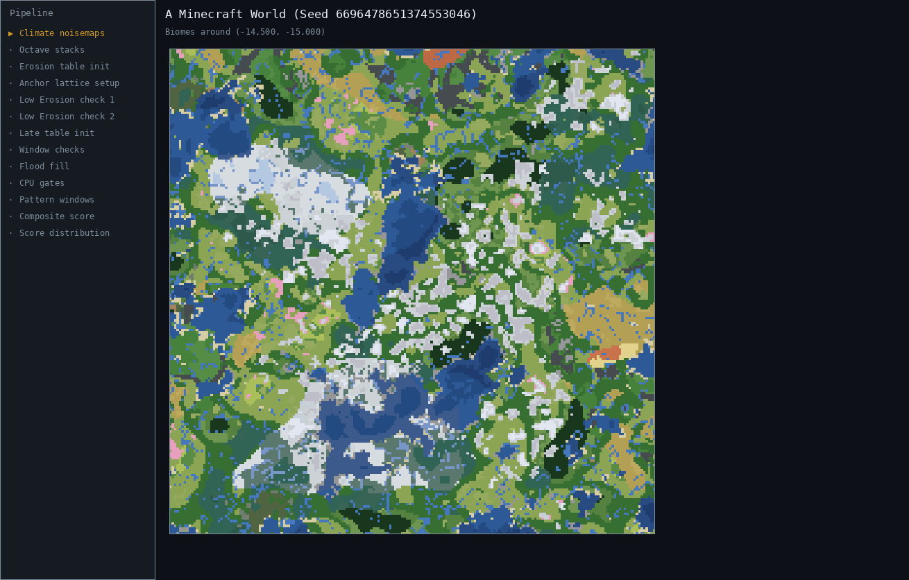
</p>

Notice that when you overlay the Temperature noisemap over the base map, the two dark blobs correspond to the cold, snowy regions of the map. And when you overlay the Continentalness noisemap over the base map, the two dark blobs happen to coincide with the oceans!

Every major landscape pattern can be traced back to at least one of these noisemaps.

Now, what about big mountain ranges? Those are primarily shaped by three noisemaps, the most influential of which is Erosion, followed by Continentalness (and, to some extent, Weirdness). Tall mountains need both low Erosion (very dark blobs on the noisemap) and medium/high Continentalness (gray or white blobs). This is because _high_ Erosion produces flat, low landscapes, while _low_ Erosion produces more elevated landscapes. Similarly, _low_ Continentalness favors oceans, while _high_ Continentalness favors inland areas. On a finer scale, the Weirdness noisemap produces individual peaks, ridges, and bowls that define the overall texture of the mountains.

But why bother with these climate noisemaps in our quest for mountainous megaregions? Why not just scan for jagged/frozen peaks biomes directly?

Because to determine whether such biomes can even generate in a given area, we must first precalculate several climate noisemaps, which is computationally expensive, especially when we need to do this billions of times during a seed search. Thankfully, we can use our knowledge of how certain noisemaps shape certain landscape features to our advantage!

When scanning a region, if the Erosion noisemap does not have a substantially large low-value area, then we know we can kick that seed out, because it would be impossible for a large mountain range to form when the entire region's Erosion is too high. Now, because we discarded that seed early on, we didn't have to compute its other 4 noisemaps (Continentalness, Weirdness, Temperature, or Humidity), and we can now use the extra time we gained to check the next seed.

This is the biggest optimization in MountainRangeFinder.

But wait! There's more...


### Octaves

Every climate noisemap in Minecraft is actually a stack of several secondary noisemaps added onto each other. We call these secondary noisemaps **octaves**. The earliest octaves in the stack are very blurry, and each extra octave added on is a little bit sharper than the one before it.

Think of it like this:

Say you have a number like `1234`. How do you rewrite that number as a sum, where each additional number added makes the number significantly more precise?

1. Thousands: `1000` (an ok estimate, but still kinda blurry)
2. Hundreds: `1000` + `200` = `1200` (we're getting closer...)
3. Tens: `1000` + `200` + `30` = `1230` (we're almost there!)
4. Ones: `1000` + `200` + `30` + `4` = `1234` (there it is!)

This is the same concept behind octaves. The earliest octaves (like our number `1000`) give us a somewhat rough yet decent approximation of our final noise pattern, while the final octaves (like our number `4`) allow us to achieve full precision.

But notice that if we isolate the added terms, the earlier numbers give us a far closer estimate of the final sum than the later numbers. `4` on its own is a terrible approximation of `1234`, but the coarse `1000` gets you far closer. The same holds true for octaves. The big blurry early octaves do the heavy lifting, while the fine octaves at the end are the sprinkles on the cake.

The example I gave above assumes that all octaves contribute their full value to the final sum. But in reality, every octave comes with an **amplitude**: a number that multiplies _how much_ that octave contributes to the final sum. It's as if each term in our running total got its own coefficient:

$\displaystyle {\color{#16C60C}\mathbf{1}} \times 1000 \enspace + \enspace {\color{#16C60C}\mathbf{1}} \times 200 \enspace + \enspace {\color{#E74856}\mathbf{0}} \times 30 \enspace + \enspace {\color{#16C60C}\mathbf{1}} \times 4 \enspace = \enspace 1204$

Here, the `30` term has an amplitude of ${\color{#E74856}\mathbf{0}}$, which cancels its contribution entirely. And when Minecraft's generation system sees an octave with amplitude 0, it completely skips over it, rather than wasting time calculating something that wouldn't change the final outcome.

Every noisemap has its own list of amplitudes assigned to its octaves (see the table below for the full breakdown). These amplitudes determine how much influence each octave will have on the final sum, or whether that octave will influence the sum at all.

|Climate Noise Type|Total Octaves|Active Octaves|
|-|-|-|
|**Temperature**|6|0 + 2|
|**Continentalness**|9|0 + 1 + 2 + 3 + 4 + 5 + 6 + 7 + 8|
|**Erosion**|5|0 + 1 + 3 + 4|
|**Humidity**|6|0 + 1|
|**Weirdness**|6|0 + 1 + 2|


In Erosion's case, for example, you can see that octave 2 is entirely skipped; this is because its amplitude is 0. This means that the final Erosion noisemap is calculated using only octaves 0, 1, 3, and 4. Temperature plays the same trick even harder, keeping only octaves 0 and 2, and skipping the other four slots altogether! Continentalness, on the other hand, uses every slot it was issued. That's a big reason why you sometimes find inland ocean "lakes" in an otherwise continental region -- the 9 octaves of Continentalness contribute to a lot of local variance.

But what if I told you there's one more trick hiding behind the scenes?

Turns out an octave isn't just one noisemap, but _two!_ In fact, a single octave is composed of two overlaid "sub-noisemaps", nicknamed **A** and **B**. These two distinct noisemaps smooth each other out when layered on top of each other.

Think of it this way: imagine a classroom with two projectors pointed at the same projection screen. Projector **A** shines one noise pattern onto the screen, while projector **B** shines a different noise pattern onto the same screen. Wherever both projections are bright, the screen shines even brighter; and wherever both projections are dark, the screen appears darker. When you have one projector shining a bright area over the same spot where the other projector projects a dark area, the two cancel out and the screen appears grayish.

But why waste money installing two projectors when one would do the trick at half the cost?

It's because 2D Perlin noise has a weird quirk: it's pinned to a large square grid, and the math forces its value to hit an exact zero at every grid corner. If left alone, these zeroed-out corners would leave an unnatural pattern of suspiciously straight rows and columns running throughout, which would make the final Minecraft map look predictably gridlike when zoomed out.

And that's exactly why we use sub-noisemap **B** to save the day. Since its pattern is different from **A** (despite being derived from the same seed), it's almost never zero exactly where **A**'s grid is zero, and vice versa. Essentially, each sub-noisemap plugs the other's grid holes, and the unnatural-looking grid pattern melts away. (**B**'s noise grains are also ever so slightly finer than **A**'s, so the two grids never get the chance to line back up.)

As a side effect, the merged octave only goes pitch black where both sub-noisemaps are dark at the same spot, which makes extreme low values properly rare. That's why it's so hard to find a truly massive mountainous megaregion -- you're essentially fishing for a large enough area where both Erosion sub-noisemaps happen to be dark, particularly on octave 0, the most influential octave.

Since every octave is composed of two layered sub-noisemaps **A** and **B**, we write an octave as a sum of both; for example, the first Erosion octave is **0A + 0B**. We can now expand the table from above to reflect this:

|Climate Noise Type|Total Octaves|Active Octaves and their "Sub-Noisemaps"|
|-|-|-|
|**Temperature**|6|0A + 0B + 2A + 2B|
|**Continentalness**|9|0A + 0B + 1A + 1B + 2A + 2B + 3A + 3B + 4A + 4B + 5A + 5B + 6A + 6B + 7A + 7B + 8A + 8B|
|**Erosion**|5|0A + 0B + 1A + 1B + 3A + 3B + 4A + 4B|
|**Humidity**|6|0A + 0B + 1A + 1B|
|**Weirdness**|6|0A + 0B + 1A + 1B + 2A + 2B|


Now you can see how the final climate noisemap is really composed of a long sum of individual noise octaves, from coarse to fine, and each octave is itself composed of two sub-noisemaps to avoid the unnatural gridlike pattern in the noise.

The animation below showcases how different Erosion octaves (and their sub-noisemaps) look on a sample map featuring a rather humble but charming mountainous megaregion. Notice how sub-noisemap 0A alone (blue line) is a lousy approximation of the final noisemap (white squiggly line); but the full 0A + 0B duo (green line) is a much more accurate representation of the final noisemap. This duo is exactly what MountainRangeFinder uses in its searches. Rather than generating the full octave stack before searching for big dark areas, it only generates the first octave, which is many times faster, and usually accurate enough to spot most megaregions.

<p align="center">
  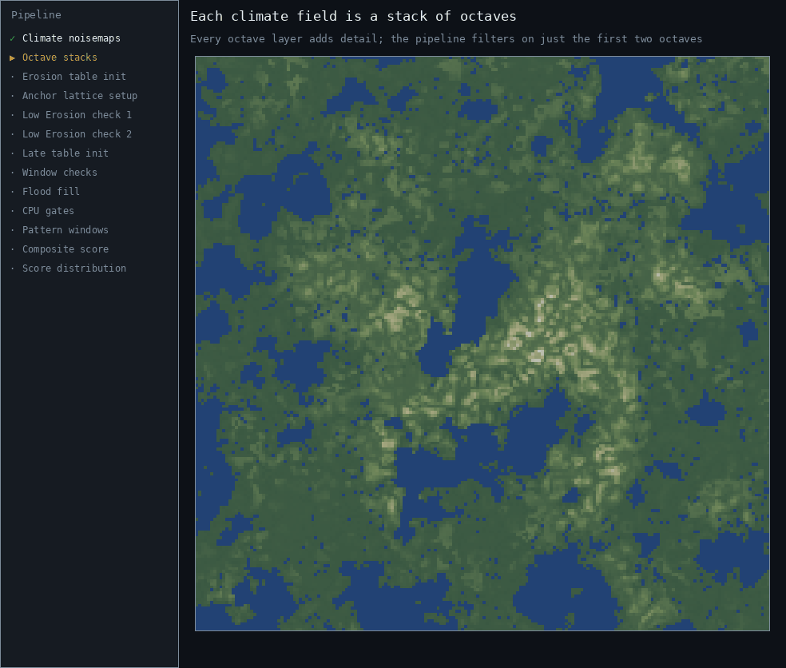
</p>

Later in the pipeline, MRF actually does compute the full octaves, but only for the seeds that survived the initial rough checks at early octaves. This order of operations serves as an efficient filtering mechanism, where you only dedicate computational effort to seeds with regions that passed the preliminary rough checks.

That's why MRF can search through millions of seeds per second, despite the search area of every seed being roughly the size of Hong Kong (assuming 1 block² = 1 meter²).


### The Search Region

Speaking of the search area, that Hong Kong-sized search region which MRF scans takes the shape of a square of side length 32,000 blocks, centered on the origin. That's over a _billion_ blocks searched per seed! The reason for these bounds is twofold:

1. Maintaining walkability from spawn
2. Ensuring that a stronghold is likely to be located near the mountainous megaregion

Since strongholds only generate up to 24,320 blocks out in any radial direction from the origin (per the [Minecraft Wiki](https://minecraft.wiki/w/Stronghold); `nextStronghold()` in Cubiomes' [finders.c](/cubiomes/finders.c) models the pre-refactor placement, which tops out 128 blocks shy at 24,192), that means the farthest they can generate in any ordinal (diagonal) direction is at coordinates (±17,197, ±17,197), which is just outside the corners of MRF's search square.

<details style="color: #aaaaaa;">
<summary>Proof<br></br></summary>

<dl><dd>

In the four cardinal directions, the coordinates of the farthest possible stronghold are (0, ±24,320) or (±24,320, 0).

In the four ordinal directions, they lie within (±17,197, ±17,197). We can derive these values from the Pythagorean Theorem:

a² + b² = c²

This formula describes a right triangle anchored on the origin, with side length `a` going in the ±x-direction, and side length `b` going in the ±z-direction. `c` is the straight-line distance from the origin along the hypotenuse. Since our search region is a square, we can infer that the length of the two sides `a` and `b` must be equal; in other words,

|a| = |b|

Since squaring a number ignores its sign, we can drop the absolute value bars and rewrite our Pythagorean formula like this:

a² + a² = c²

Then we can combine like terms:

2a² = c²

Now, since our coordinates consist of a pair of side lengths, and we know each side length of a square is equal, and we want to find out what that side length is, we must solve for `a`:

2a²/2 = c²/2

a² = c²/2

√(a²) = √(c²/2)

±a = √(c²/2)

a = ±c/√2

Great! Now we have a formula for `a`, our side length. Thankfully, we know that `c` represents how far away the farthest possible stronghold can generate, which is 24,320 blocks (if you go by the wiki). This means we can just plug-and-chug:

a = ±24,320/√2

a ≈ ±17,196.8 blocks

And since MRF's search square's corners are at approximately (±16,000, ±16,000), 22,627 blocks from the origin, this proves MRF's search square fits just inside the last stronghold ring. All seven inner rings pass right through the search square (the seventh reaches 21,248 blocks out), and the eighth ring's inner edge begins at 22,912 blocks, a mere 285 blocks past the corners. In other words, no matter where a megaregion lands inside the square, a stronghold ring or two passes through its neighborhood.

(Note that MRF sometimes returns coordinates several thousand blocks beyond ±16,000. This is because the best-scoring subregion of a mountainous megaregion may lie outside of the 16k-radius search square, as determined by the later stages of the pipeline -- see [Flood Fill](#flood-fill-how-big-is-the-region) and [Calculating the Score](#the-goldilocks-window-calculating-a-score).)

</dd></dl>

</details>

<span id="anchor-intro"></span>If MountainRangeFinder were to search all 1 billion+ blocks for every seed, it would take roughly 640,000 times longer! Instead, it sets up a coarse grid over the search square, and samples only the grid points, called **anchors**. The anchors are used to probe the **Erosion** noisemap initialized at just the first octave (0A + 0B). The idea is that if there's a big low-Erosion blob somewhere within the 32k search square, at least one of the anchors will register it, and will tell MRF to investigate further. More specifically, every anchor runs a [7-point probe](#the-7-point-hex-probe) on the Erosion 0A + 0B field, and every anchor that passes carries the seed onward to deeper checks. A seed only gets kicked out once all of its anchors have failed their probes.

Now, the big question is, "How far apart should the anchors be?"

If we place them too far, then some low-Erosion mega-blobs will fall through unnoticed. On the other hand, if we place the anchors too close, then we pay for a whole bunch of redundant checks for every seed, slowing down the number of seeds we can search per second.

In any case, the obvious approach is to set up some sort of square grid.

If we place our anchors 3,200 blocks apart, then we fill our 32k search square with 11 × 11 = 121 anchors per seed. But what if a mountainous megaregion happens to snake in between these anchors? We might miss it with our anchors spread this far apart. Our search would be efficient but unreliable.

If we instead place our anchors 1,600 blocks apart, we'd fill our 32k square with 21 × 21 = 441 anchors per seed. That gives us much better coverage. Heuristically, a mountainous megaregion will almost never slip through these cracks. But we've also more than tripled the number of anchors, thereby slowing down the algorithm. Is there a way to tweak our grid so that we use less anchors without sacrificing coverage?

Turns out there is! Allow me to introduce... the hexagon! The same shape bees use to construct honeycombs, and phone companies use for tower coverage. It's an incredibly efficient shape with some really cool properties.

We can morph our square grid into a **hexagonal lattice** by nudging every other row half a step sideways, and stretching out the spacing a little bit. Wait -- _stretching out?!_ Won't that hurt coverage when the anchors are farther apart? Surprisingly, no! That's the magic of the hexagonal lattice.

Let's try this: the anchors in our square grid were 1,600 blocks apart. Let's convert the square grid to a hexagonal lattice where each anchor is 1,920 blocks apart. At first glance it may seem the coverage will suffer because the anchors are now 320 blocks farther apart, but the math surprisingly tells us a different story.

Before, the diagonal worst-case point between anchors was **1,131** blocks ≈ 1,600 ÷ √2 (marked by the red ${\color{#E74856}\mathbf{X}}$ in the animation below). But now, the diagonal worst-case point between our new hex anchors is just **1,109** blocks ≈ 1,920 ÷ √3. Counterintuitively, we've actually _improved_ our coverage, despite our anchors being farther apart! With a shorter worst-case distance between anchors, we effectively allow even fewer potential megaregions to slip through -- virtually none! And because anchors are spaced 20% farther apart, we only need 399 hex anchors to fill our search square, instead of 441 square anchors. This allows us to search more seeds faster while improving accuracy. Win-win!

<p align="center" id="lattice-gif">
  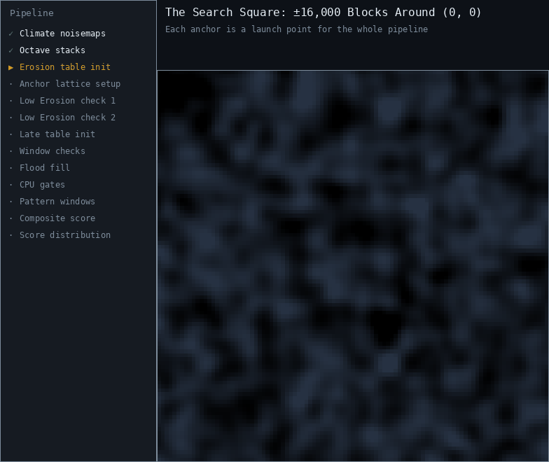
</p>


### The 7-Point Hex Probe

When an anchor reports that it found a low-Erosion point, MountainRangeFinder swoops in to investigate with a more fine-toothed comb. Is this just a stray point, or does this low-Erosion pattern continue beyond the point?

To answer this question, the algorithm spawns 6 additional points around the anchor point, forming a mini hexagon at the halfway points between the base anchor and the neighboring anchors. If at least 6 out of the total 7 points return an Erosion value below a slightly looser threshold (i.e. -0.30 or less), then MRF knows this area has potential, and so it advances to the next check (the [sunflower spiral](#the-96-point-sunflower-spiral)), where it analyzes the low-Erosion area with an even finer-toothed comb.


<p align="center">
  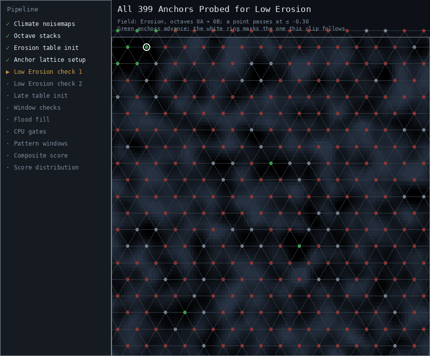
</p>

Why the looser low-Erosion threshold of -0.30, when the region we're ultimately hunting lives at or below -0.35? Because this 7-point probe is a sniff test to determine whether or not this area is worth investigating further. Any single sample can land on a bright fleck (like a pocket of higher Erosion poking into an otherwise low-Erosion neighborhood), and we don't want a borderline area disqualified over one unlucky sample. So the cheap gate opens wider than the threshold the region will eventually have to clear.

Another glorious benefit the hexagon bestows upon us is the reusability of probe points. You see, because an anchor's probe point lies halfway between a neighboring anchor, that means that anchor shares a probe point with its neighbor. So instead of computing 7 samples for each of the 399 anchors (2,793 samples per seed), the whole lattice only needs each anchor's center plus each shared midpoint once: about 4 samples per anchor, or 1,596 per seed. That's 3 evaluations saved per anchor, which really adds up when you're probing tens of millions of seeds per second. Another win for the hexagon!

The vast majority of anchors fail at this hex probe check, since there are far more isolated low-Erosion regions than large contiguous low-Erosion blobs.


### The 96-Point Sunflower Spiral

Any anchors that pass the 7-point probe check move on to the more demanding **phyllotaxis spiral** check. This stage takes place within a 1,600-radius disc tucked snugly within a hexagon whose corners are the neighboring anchors. Within this disc, the algorithm plops down 96 points in a Fibonacci spiral pattern, which is the same pattern you see in a sunflower or pinecone. Each point steps in a ~137.5° spiral pattern, radiating outward, until it hits the edge of the disc, after which it returns to the center area and continues the pattern. Each point checks if the Erosion value is -0.40 or less, and if at least 77 points pass (~80%), then MRF moves on to the next set of checks.

<p align="center">
  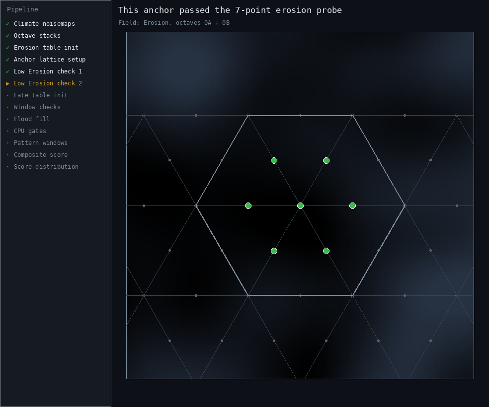
</p>

This is an efficient way to ascertain the cohesion of the low-Erosion area without needing to sample all 8 million blocks within the disc. The 80% coverage requirement allows for a few higher-Erosion pockets to interrupt the otherwise cohesive low-Erosion blob. Since we're sampling just the first octave of the Erosion field, we want to allow it some wiggle room, since the final Erosion noisemap with all octaves will likely resolve more detail that may include locally high-Erosion pockets, which shouldn't necessarily disqualify the entire region. The important thing is that the core part of the region contains a substantial low-Erosion area, which will hopefully provide the right conditions for a large mountain range.

At the same time, this stage also tightens the low-Erosion threshold to -0.40 to have even greater assurance that the region will truly support a potentially massive mountain formation.

To speed things up, the sunflower spiral keeps a running tally and checks it between 32-point batches. Only 19 of the 96 samples are allowed to miss, so a couple of unlucky batches end the scan early. The same trick works in reverse: the moment the 77th hit lands, the disc passes on the spot and the leftover samples never get evaluated. This "lazy" algorithm ensures no time is spent checking points once it becomes clear that it would be impossible to meet the 77-point threshold.

If the sunflower spiral check passes, the anchor gets repositioned to the **centroid** of its dark samples -- the center of mass of the low-Erosion points in the disc. The hexagonal lattice was never meant to land exactly on the blob; its job was to get close. From here on, the pipeline works from the blob's actual low-Erosion heart. (And notice how the disc's 1,600-block reach comfortably swallows the lattice's 1,109-block worst-case distance from the search grid section. Geometrically, every point in the big search square falls inside at least one anchor's disc, so there are no blind spots between anchors.)


### Do the Fields Align?

So far, we've only been running a series of checks on the Erosion 0A + 0B field, since Erosion is the biggest predictor of mountainous terrain. But what happens after we've found a region with a sufficiently large low-Erosion blob?

A mountain won't generate in an ocean, so we need to check for high Continentalness. We're not looking for frozen or parched terrain, so we need a Temperature range check, too. And we need a height check to make sure our region actually has mountains rather than molehills!

With our new anchor as our reference point, MRF initializes the remaining 32 climate noisemap stacks for this seed, in their full-octave glory (well, except for Weirdness, who fittingly shows up half-dressed), and runs a sequence of tests, from cheapest to costliest. Each test reads only the octaves it needs (see the table below). If even one test fails, it exits early and discards that area entirely.

<p align="center">
  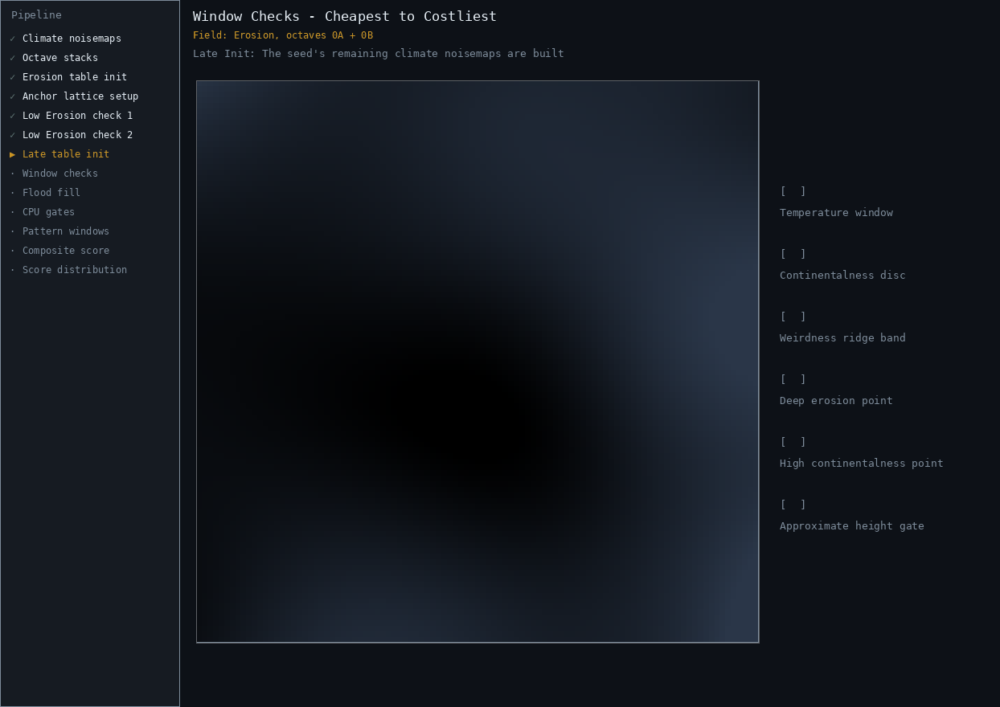
</p>

Here are the specifics of each window check:

|#|Check Type|Layout|Threshold|Purpose|
|-|-|-|-|-|
|**1.**|**Temperature %**: all octaves|121 grid pts in a 1,000×1,000 square|≥65% of pts in the range [-0.40, 0.20]|Target cool and temperate climates|
|**2.**|**Continentalness %**: 0A + 0B + 1A + 1B|96 pts in a phyllotaxis disc of radius 1,600|≥~67% of pts ≥0|Exclude predominantly oceanic regions|
|**3.**|**Weirdness %**: 0A + 0B + 1A + 1B|1,089 grid pts in a 3,200×3,200 square|≥1.2% of pts with \|w\| in the range [0.55, 0.82]|Ensure localized peaks & ridges exist|
|**4.**|**Erosion pt**: all octaves|2,601 grid pts in a 3,200×3,200 square|min ≤ -1.15|Make sure there exists a point with very low Erosion|
|**5.**|**Continentalness pt**: all octaves|2,601 grid pts in a 3,200×3,200 square|max ≥ 0.70|Make sure there exists a point with high Continentalness|
|**6.**|**Approx height pt**|625 grid pts in a 3,072×3,072 square|max height Y ≥ 215|Make sure tall terrain exists|


<details style="color: #aaaaaa;">
<summary>Note on Humidity<br></br></summary>

<dd>

MRF doesn't actually filter on Humidity, since Temperature already does a good enough job in selecting the kinds of climates MRF prefers. Humidity also has no bearing on the types of mountains present in a region; jagged, frozen, and stony peaks can generate in any Humidity zone.

</dd>

</details>


### Flood Fill: How Big is the Region?

If all the window checks from the previous step passed, we now know we have a strong contender that's highly likely to generate mountainous terrain around the anchor.

But the point of MountainRangeFinder isn't merely to find a mountainous region, but a mountainous _megaregion_. Go big or go home!

That's why MRF's next check is designed to measure the extent of the mountain blob. It does so using an algorithm called flood fill.

Think of it like someone pouring a paint bucket over a trough. A small trough will only need a little bit of paint to fill, but a big trough will need a flood of paint to fill! MRF simulates this over the climate fields by checking three conditions at the center of each 64×64-block cell: 

1. Erosion 0A + 0B must be at most `--ero-max` (-0.35 by default), 
2. Continentalness 0A + 0B + 1A + 1B must be at least `--cont-min` (-0.12 by default), and 
3. Temperature 0A + 0B must be within `--temp-range` (-0.45 to 0.20 by default). 

If a cell passes all three conditions, MRF "paints" it, and then it repeats this procedure for every adjacent unvisited neighbor. This is essentially a breadth-first search, for those of you who have taken an Algorithms & Data Structures class. And the reason we check all 3 noise fields is because we want to avoid big patches that happen to be underwater or frozen solid, which we might otherwise get if we only checked for Erosion.

The first part of this flood fill is handled by the fast-but-imprecise GPU, searching a square window 16k blocks wide. If the GPU "paints" at least 3,867 connected 64×64-block cells (assuming `--min-blob-area` holds the default value of 18 million blocks²), then it passes its baton to the slower-but-accurate CPU, which restarts the flood fill from the same anchor. That bar deliberately sits 12% below the CPU's real gate; the GPU measures with 32-bit floats inside a smaller window, and a blob hovering right at the edge of the real gate should never get clipped by a rounding error before the CPU gets its say. And there's an escape hatch, too. If there's a range so long that it runs off the GPU's window edge, it still gets forwarded to the CPU (as long as it painted at least half the target), since only the CPU's bigger window can measure the whole snake. In a [later stage](#cpu-flood-fill-recheck), the CPU completes the flood fill, covering all adjacent qualifying cells within a square window 96k blocks wide.

<p align="center">
  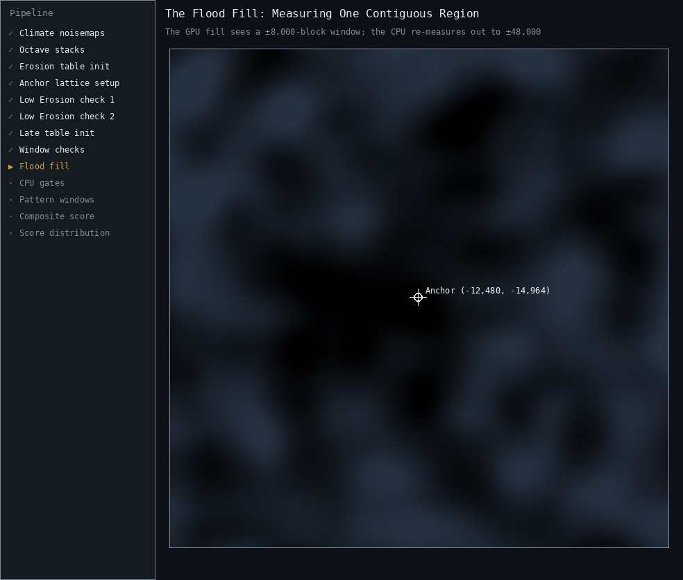
</p>

Once the entire low-Erosion blob has been painted over, MRF pulls a fancy trick. What if a contiguous low-Erosion megaregion is split in two by a higher-Erosion river valley that's only one 64×64-block-cell wide? Should a small increase in Erosion chop up an otherwise impressive megaregion in two, or should the megaregion include its estranged relative just across the creek? MRF treats this cut-off region as part of the family, and in order to do so, it applies a technique called **morphological closing**; specifically, **dilation** and **erosion**. Note that the erosion in this context is different than the Erosion noisemap it's measuring. Dilation expands the outer boundary of the painted blob by one cell, swallowing any 1-cell gaps. Erosion then contracts this swollen outer boundary back to its previous state, and keeps any 1-cell bands that "closed" the gap between two preexisting painted regions. Most of the time, morphological closing doesn't radically alter the final megaregion's size. But when it does, it makes this trick well worth it!

Now, the last trick that MRF pulls during this flood-fill saga is finding the center of the thickest region within the low-Erosion blob, and measuring its distance from the nearest blob edge. What good is a long, narrow, noodle-like megaregion if it doesn't have a substantial mountainous core? A spaghetti strip of mountains running through a flat, mediocre landscape is rather anti-climactic. As such, MRF requires a mountainous megaregion to have a substantial enough core (the same core whose radius you can configure with the `--min-core-width` flag). To determine the size of this core, MRF runs an algorithm called **chamfer distance transform** to find the radius of the largest circle that fits entirely inside the region.

Chamfer distance transform is an efficient approximation of Euclidean distance that avoids expensive square roots (pages 21 and 24 of this [research paper](https://people.cmm.minesparis.psl.eu/users/marcoteg/cv/publi_pdf/MM_refs/1986_Borgefors_distance.pdf) showcase just how good of an approximation to Euclidean distance it is, compared to Manhattan distance and other approximations). It behaves similarly to morphological closing's erosion, uniformly chipping away at the blob's outer edges until it converges upon one or more "islands" which mark the farthest point from any edge. Or, think of it like a brushfire ring burning its way inward, and the last unburnt blotches were the ones farthest inward.


### The CPU's Quality Control

As mentioned, the GPU is great at speed, but the CPU wins in accuracy. Since the CPU can natively crunch numbers in 64-bit double precision (while the GPU had to make do with 32-bit floats), and up til now has been largely sitting idle as the GPU put in all the grunt work, this is the part of the pipeline where the CPU gets to shine, as it works through the final checks with the finest-toothed comb.

We have 3 more checks before we can confidently declare that we've found a mountainous megaregion.

First, we have the pipeline's first biome check, which verifies that the core blob is not covered in dark forest. As I mentioned [above](#dark-forest-filter), I'm not a fan of this biome because it's basically a 24/7 mob spawner. Its thick canopy blocks out sunlight, letting mobs spawn even during daylight. I don't like being sniped by skellies at high noon! So, if MRF finds that at least 7% of the samples in a 1,365-radius disc around the anchor report a dark forest, then the candidate goes straight to the landfill. (Granted, you can absolutely disable this filter using the `--no-dark-forest` flag... and doing so will significantly increase the candidate pool!)

<p align="center">
  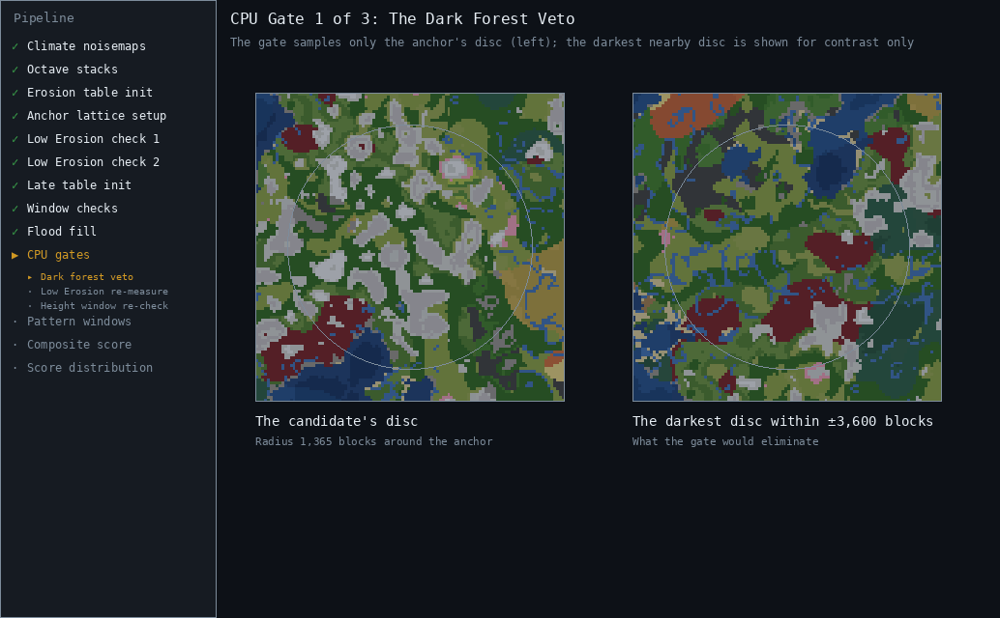
</p>

<span id="cpu-flood-fill-recheck"></span>The second check the CPU runs is a re-check of the GPU's flood fill. Whereas the GPU carried out a rough check, now is the CPU's turn to redo its job with higher precision and within a larger, 96k-block-wide square, carrying out the flood fill across three noise fields: Erosion 0A + 0B, Continentalness 0A + 0B + 1A + 1B, and Temperature 0A + 0B, to see just how big the mountainous region truly is. And this time the numbers are final: the region's true area must clear `--min-blob-area`, and its inscribed core radius must clear `--min-core-width`. These re-measured numbers are what get reported in `output.txt`.

<p align="center">
  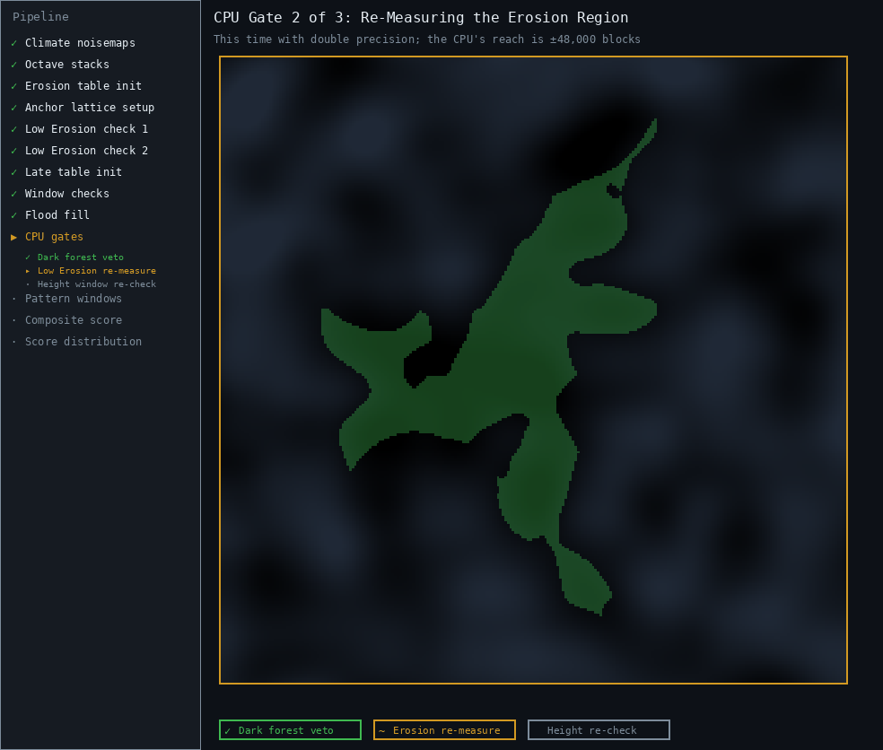
</p>

And finally, the third check in this 3-part sequence is a height re-check. The GPU alleged that it found a tall spot. The CPU now verifies its claim. A square-shaped spiral of approximate-height samples emanates from the anchor, walking outward in 64-block steps out to 1,600 blocks (clipped to a disc), and the gate passes if at least one sample lands inside the required height range (`--min-height` to `--max-height`, or Y 230 to 320 by default). It even handles near-misses smartly: if no single sample lands inside the height range, but the highest sample observed reaches past the range's floor while the lowest sample sits below its ceiling, the gate takes that as good evidence that the terrain climbs through the target heights somewhere between sample points. Height is continuous, after all; you can't walk from Y 220 to Y 240 without stepping through Y 230.

If all three of these CPU checks passed, we now know for sure that we've found a mountainous megaregion!


### The Goldilocks Window: Calculating a Score

Now, just because we found a mountainous megaregion, doesn't mean it contains truly stunning mountains. Our height check confirmed that there's at least one tall mountain, but what if that's the only one? It may very well be surrounded by puny molehills spread far apart, for all we know. Or perhaps the surroundings of the megaregion are quite uninspiring and dull.

The next stage in the pipeline measures the megaregion and turns those measurements into a score, so we know if it's even worth opening up in Cubiomes Viewer.

To do this, MRF uses three sliding windows that scan the megaregion's bounding box to measure various features within each window snapshot, like average peak height and biome distribution. It keeps track of which features aligned most favorably, and remembers where this best-patterned window landed (the green box in the animation below).

The animation only shows the 1,664-block sliding window for simplicity, but in reality, MRF slides three windows (measuring 896, 1,664, and 3,200 blocks across, respectively) across the megaregion's bounding box.

<p align="center">
  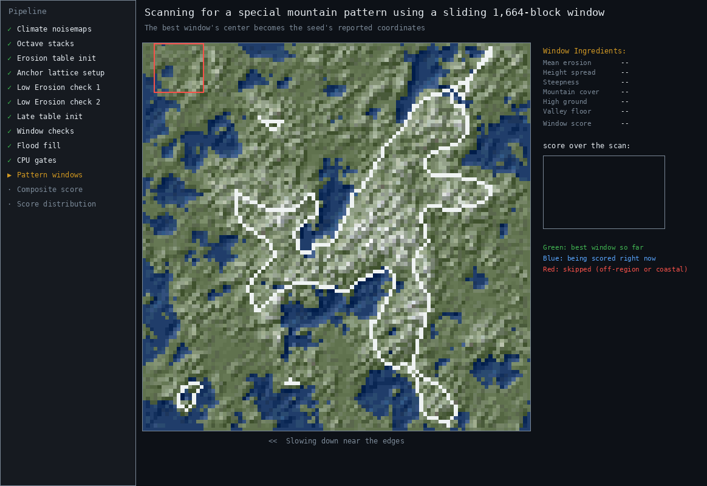
</p>

But why not just measure the pattern across the whole megaregion? Because oftentimes the prettiest mountain area exists as an enclave of the megaregion; rarely does it happen that the _entire_ megaregion contains tall, stunning mountains and deep valley gorges. MRF wants to find whether such a cool enclave exists, and if it does, MRF assigns it a good score to give it precedence over other seeds whose megaregions don't contain such a charming area.

To explore each pattern MRF checks for, click to reveal a table:

<details>
<summary>The Window Recipe (click to expand)</summary>

<br>

Every window, no matter its size, gets graded on the same seven-ingredient rubric. Each ingredient compares the window against a reference value that the current calibration considers "just right" (if you don't like the results from the current calibration, you can always [recalibrate the scoring system](#how-to-recalibrate-the-scoring-system) to better fit your tastes).

<span id="goldilocks-window-table"></span>Listed in order of influence:

|Metric|`output.txt` column|Influence|Reference value|What It Measures|
|-|-|-|-|-|
|**Steepness**|`bw###Dh`|1.00|36 blocks|Mean height difference between adjacent 128-block samples inside the window; how dramatically the terrain leaps around|
|**Height spread**|`bw###hStd`|0.70|40 blocks|Height standard deviation inside the window; peaks _and_ valleys packed into one neighborhood|
|**High ground**|`bw###Hi`|0.40|10%|Share of window cells at Y ≥ 200 (stops earning past 30%)|
|**Valley floor**|`bw###Lo`|0.35|2%|Share of window cells sitting at sea level (Y ≤ 63) with ocean cells excluded, so a flooded window can't score points for being "low" (stops earning past 8%)|
|**Mean erosion**|`bw###Ero`|0.35|-0.90|Mean full-octave erosion of the window; how deep the mountain-making signal runs beneath it|
|**Mountain cover**|`bw###Mtn`|0.30|35%|Share of the window carpeted by mountain biomes (peaks, groves, snowy slopes), with diminishing returns past 62%|
|**Ocean penalty**|`bw###Ocn`|-3.00 per share|none|A hard toll on ocean inside the window; a cliff plunging straight into the sea is a different kind of special, and doesn't get to win this particular contest|


(Each of these stats exists separately for the winning 896-, 1,664-, and 3,200-block window. The `bw###` names above use `###` as a stand-in for the size, with `bw` meaning "best window".)

Additionally, there are three extra rules to keep measurements consistent:

1. A window is only scored if at least half of it lies inside the megaregion.
2. Windows more than 15% ocean are disqualified outright.
3. Windows hanging off the megaregion's edge (below 85% coverage) lose credit in proportion to how far they dangle.

The best 1,664-block's center point becomes the seed's **headline coordinates** in `output.txt`. (The best 896-block is the understudy for regions too small to fill the bigger window, while the best 3,200-block doubles as the pattern-at-scale test you'll see in the final score.)

</details>


### Determining a Megaregion's Final Score

So how do a bunch of window measurements turn into a single score that determines how epic the mountainous megaregion is? The best windows' measurements, in combination with a stack of region-wide stats gathered from the same 128-block grid, get sorted into five **aspects**, each graded individually before being consolidated into the final score: 

|Aspect|Purpose|
|-|-|
|**Amplitude**|Tall, prominent peaks|
|**Texture**|Fine-grained ruggedness between neighboring samples|
|**Peak packing**|Many individual densely-packed peaks, rather than one big plateau-like massif|
|**Valley depth**|Deep valley floors and gorges between mountains|
|**Dark forest**|Avoid regions with too much dark forest|


And here's how the window measurements (after getting standardized) contribute to each aspect:

**Amplitude** mixes the main window's height spread and high ground with the region's tallest point and its peaks' average prominence. **Texture** is a combination of the main window's steepness, the 896-block window's steepness (as a fine-grain second opinion), and the region's valley-crossing density. **Peak packing** counts the region's separate summit clusters and checks that there's no single mountain massif hogging up all the space. **Valley depth** combines the region's deepest 896-block mountain bowl (if present) and lowest point with the main window's valley-floor share, plus the fraction of low floors sitting right beside tall walls. **Dark forest** reads the main window's dark forest coverage, along with a sample ring around the main window. 

All of those measurements come in incompatible units; eg. heights are in blocks, coverages are in fractions of a window, etc. Before they can be integrated into a unified score, each one gets translated into a **z-score**, which is a number that tells us _how far_ the measurement sits from a reference value, expressed in units of how much that measurement typically wobbles from region to region. A z-score of 0 means "typical", +1 means "one typical wobble above typical", and +2 starts getting us into uncommon territory. And the default reference values were determined by the same process described in the [recalibration section](#how-to-recalibrate-the-scoring-system).

Once every measurement has been standardized into a z-score, it gets evaluated based on this set of rules:

- **The weakest aspect gets twice the influence.** A truly magical region has to be strong in all 5 aspects, which is why the algorithm selects the weakest-scoring aspect as the main representative.
- **The aspect sum breaks ties** (× 0.30), so if two regions share the same weakest aspect, the one that performs better everywhere else still comes out ahead.
- **Extent** (× 1.10) rewards the pattern showing up across a large area.
- **Consensus** (× 1.25) is a conglomeration of 39 z-scored measurements I custom-calibrated across several training passes (eg. `bw3200Dh`, `dhMean`, `peakProm`, etc.).
- **Penalties** get imposed if there's dark forest inside the pattern window past ~5.5% coverage, or if a plateau/massif hoards more than 55% of the high ground.
- **Setting** adds up to +0.80 for the scenery around the region (fjords, inland seas, cliffy coasts, oddball biomes next door), but only if the core pattern clears a certain quality threshold. Lovely surroundings can break a tie, but they can't rescue an ugly megaregion.

The animation below demonstrates how the sample seed we've been following (6696478651374553046) gets scored:

<p align="center">
  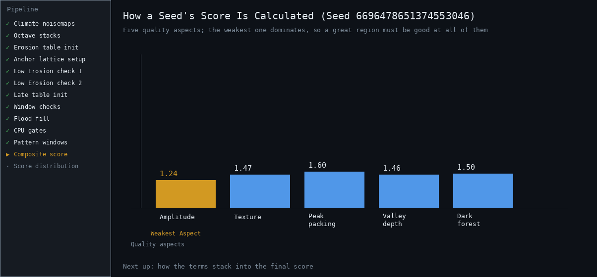
</p>

Two more things worth explaining:

<span id="phases-explanation"></span>First of all, every region gets measured on four interleaved sampling grids, each offset by half a cell from the last, and only the best-scoring grid is kept. A spectacular region should never tank its score just because the measurement lattice happened to fall between its peaks! (This is also why enrichment is the expensive part of verification, and why `--phases 1` exists for fast bulk re-verification.) 

Secondly, the early stages of the algorithm often find several anchors living in the same megaregion. If all these anchors were allowed to pass, you'd get a ton of duplicate seed rows in `output.txt`, whose coordinates would land in a different part of the same megaregion. This is why MRF clusters anchors that lie within 8,000 blocks of each other, and chooses only the best-scoring row from each cluster.

<details>
<summary>Score Reference Tables: All 95 Variables (click to expand)<span id="score-reference-tables"></span></summary>

<br>

Here's a complete overview of all 95 variables that influence the final score or provide diagnostic measurements, according to [probe.cpp](/probe.cpp). Hold on to your hats, because it's quite the list!

Every variable measures something unique about the mountainous region, from valley interconnectivity to how nice the surrounding scenery is. Some of these variables directly feed into the [five aspects](#determining-a-megaregions-final-score)
, others feed the calibrated consensus model, and still others are diagnostics that ride along in `output.txt` without scoring anything (handy for future recalibrations). The reference values and weights have been tuned over several [calibration](#how-to-recalibrate-the-scoring-system) runs.

#### **Region-Wide Terrain**

|Metric|Feeds Into (weight)|What It Measures|
|---|---|---|
|`hMin`|Valley depth (0.35)|The lowest approximate height in the region; how close it gets to sea level|
|`hMax`|Amplitude (0.30) + Consensus (+0.77)|The single tallest summit the sampler found|
|`hMean`|Consensus (+0.86)|Average height across the region. Distinguishes between high-altitude country vs. flatlands with a few lucky spikes|
|`hP90`|Consensus (+0.89)|The height the tallest tenth of the region clears. Similar to `hMax`, but immune to one lucky spike|
|`hStd`|Consensus (+0.85)|How much heights vary across the whole region. Big number means lots of ups and downs|
|`relief`|Consensus (+0.83)|How often two neighboring samples (128 blocks apart) differ by a height of 96 blocks or more; measures abrupt drops|
|`high`|Consensus (+0.87)|What share of the region sits at Y 200 or above. Snowline real estate|
|`low`|Consensus (−0.88)|What share of the region sits at Y 116 or below. A little means valleys; a lot means flatland, so the calibration counts it against the region|
|`dhMean`|Consensus (+0.99)|The average height jump between neighboring 128-block samples. The region's overall jaggedness|


#### **Climate & Weirdness Texture**

|Metric|Feeds Into (weight)|What It Measures|
|---|---|---|
|`eroFmean`|Consensus (−0.76)|Average full-octave erosion across the region. Mountains live at low erosion, so a deeper (more negative) average is better|
|`eroFp10`|Consensus (−0.55)|The erosion level that the lowest-erosion tenth of the region beats. "How strong is the strongest tenth?"|
|`eroFmin`|diagnostic|The single deepest erosion reading in the region
|`contFmean`|Consensus (+0.57)|Average continentalness. Higher means the region sits further inland|
|`contFmax`|Consensus (+0.59)|The most inland point. Deep-inland spots are where terrain gets pushed tallest|
|`wAbs`|diagnostic|Average absolute weirdness across the region. Weirdness near zero is where valleys and rivers carve, so a low `wAbs` means the region hugs that valley-carving midline, while a `wAbs` near ±<sup>2</sup>/<sub>3</sub> means it lives out on the ridgelines|
|`ridge`|diagnostic|How much of the region sits on ridge lines|
|`valley`|diagnostic|How much sits in valleys, where rivers like to run|
|`rcross`|diagnostic|How often two neighboring 128-block samples straddle a ridge crest (i.e. where Weirdness = ±<sup>2</sup>/<sub>3</sub>)|
|`vcross`|Texture (0.15)|How often neighboring samples straddle a valley; i.e. valley-network density|


#### **Peaks & High Ground**

|Metric|Feeds Into (weight)|What It Measures|
|---|---|---|
|`peakDensity`|diagnostic|A count of spots that rise above all four neighbors, per million blocks²; how densely peaks are packed|
|`peakProm`|Amplitude (0.25) + Consensus (+0.91)|On average, how far a typical peak rises above its neighbors. The "wow" factor of individual peaks|
|`highComps`|Peak packing (0.55) + Consensus (+0.90)|How many separate islands of Y≥200 ground exist per million blocks². Many small ones mean scattered summits; one big one means a massif|
|`highLargest`|Peak packing (−0.45) + Consensus (−0.52) + massif tax|The biggest high-ground island's share of all high ground. Close to 100% means one massif owns the skyline, and the score penalizes it for that|


#### **Range & Valley Connectivity**

|Metric|Feeds Into (weight)|What It Measures|
|---|---|---|
|`mtnCompM`|Extent (0.10)|Size of the largest unbroken stretch of mountain-flavored biomes (peaks, meadow, old growth taiga, cherry grove). The "is this one continuous range" number|
|`mtnComps`|diagnostic|How many separate mountain stretches there are|
|`lowCompM`|diagnostic|Size of the largest linked valley network of low inland ground. One big network means the valleys thread the whole region together|
|`lowComps`|diagnostic|How many separate valley networks exist. Few of them (paired with a big `lowCompM`) means the valleys are all interlinked|
|`gorgeFrac`|Valley depth (0.20)|How many of the region's low floors have a Y≥190 wall within 256 blocks. The gorge signature: deep floor + tall wall in a short walk|
|`qualN`|diagnostic|How many windows cleared the "magic region" bar|
|`qualArea`|Extent (0.15)|Size of the largest connected patch of those magic windows. How much of the region is the highlight reel, rather than one lucky corner|
|`scQ90`|Extent (0.15)|The window score that 90% of windows fall under. High means the magic shows up everywhere|


#### **Best-Pattern Windows**

|Metric|Feeds Into (weight)|What It Measures|
|---|---|---|
|`bw896Sc`|Consensus (+0.63)|Mountain pattern score of the best 896-block window (the small-scale check)|
|`bw1664Sc`|Consensus (+0.79)|Mountain pattern score of the best 1,664-block window (the medium-scale check)|
|`bw3200Sc`|Extent (0.35) + Consensus (+1.04)|Mountain pattern score of the best 3,200-block window (the large-scale check)|
|`bw896Dh`|Texture (0.30) + Consensus (+0.64)|Steepness inside the best small window|
|`bw1664Dh`|Texture (0.55) + Consensus (+0.97)|Steepness inside the best medium window|
|`bw3200Dh`|Consensus (+1.17)|Steepness inside the best big window. Currently the loudest single voice in the Consensus|
|`bw896hMean`|Consensus (+0.43)|Average height of the best small window|
|`bw1664hMean`|Consensus (+0.70)|Average height of the best medium window|
|`bw3200hMean`|Consensus (+1.04)|Average height of the best big window|
|`bw1664hStd`|Amplitude (0.25)|Height variety inside the best medium window: peaks and valleys crammed together in one neighborhood|
|`bw3200hStd`|Consensus (+0.84)|Same variety, at the big scale|
|`bw896Hi`|Consensus (+0.47)|How much of the best small window stands at Y≥200|
|`bw1664Hi`|Amplitude (0.20) + Consensus (+0.59)|How much of the best medium window stands at Y≥200|
|`bw3200Hi`|Consensus (+0.96)|How much of the best big window stands at Y≥200|
|`bw1664Lo`|Valley depth (0.20) + Consensus (−0.46)|How much of the best medium window is inland ground at sea level. Ocean cells don't count, since oceans aren't valleys|
|`bw3200Lo`|Consensus (−0.68)|Same sea-level-valley share, at the big scale|
|`bw3200Ero`|Consensus (−0.81)|Average erosion in the best big window
|`bw3200Mtn`|Consensus (+0.86)|Mountain-biome coverage of the best big window|
|`bw1664Ocn`|Setting moderator|Ocean share of the medium window. This disqualifies a window past 15% ocean, and past 8% the scenery bonus fades|
|`bw1664Dark`|Dark forest aspect + Consensus (−0.50) + bill|Dark forest share of the best medium window|


#### **Windowed Extremes**

|Metric|Feeds Into (weight)|What It Measures|
|---|---|---|
|`w896hMax`|Consensus (+0.57)|The small window with the highest average ground|
|`w1664hMax`|Consensus (+0.81)|The medium window with the highest average ground|
|`w896hMeanMin`|Valley depth (0.45)|The small window with the lowest average ground. The region's deepest valley floor|
|`w1664hMeanMin`|Consensus (+0.45)|The medium window with the lowest average ground. When even this window sits high, the whole region is alpine country|
|`w1664hStdMax`|Consensus (+0.41)|The medium window with the most peak-to-valley contrast packed in|
|`w896hStdMax`|diagnostic|The small window with the most peak-to-valley contrast packed in|
|`w896eroMin`|diagnostic|The small window where the erosion signal runs deepest on average
|`w1664eroMin`|diagnostic|The medium window where the erosion signal runs deepest on average|
|`w896mtnMax`|diagnostic|The small window most densely carpeted in mountain biomes|
|`w1664mtnMax`|diagnostic|The medium window most densely carpeted in mountain biomes|


#### **Biome Checks**

|Metric|Feeds Into (weight)|What It Measures|
|---|---|---|
|`bioMtn`|Consensus (+0.74)|Mountain biomes: peaks, groves, and snowy slopes|
|`bioMtOg`|diagnostic|Old growth spruce and pine taiga (what used to be called mega taiga)|
|`bioTg`|diagnostic|Regular and snowy taiga|
|`bioMdw`|diagnostic|Meadow|
|`bioChy`|diagnostic|Cherry grove|
|`bioDrk`|diagnostic|Dark forest|
|`bioPln`|diagnostic|Plains and sunflower plains|
|`bioRiv`|Consensus (−0.71)|Rivers. They count against the score because they usually correspond to lower mountains. That being said, isolated mountain river-lakes are encouraged (see `lakeN` below)|
|`bioOcn`|diagnostic|Oceans|


#### **Region Shape & Dark Forest**

|Metric|Feeds Into (weight)|What It Measures|
|---|---|---|
|`blobAreaBlocks2`|Extent (0.25, saturating)|The region's total connected area. The score's appetite for size levels off around 34 million blocks²|
|`coreRadiusCells`|Extent (0.15)|Radius of the biggest circle that fits entirely inside the region, in 64-block cells. The anti-noodle measurement|
|`darkCoreFrac`|Dark forest aspect (ring term)|Dark forest share of the 1,152-block sample ring around the best 1,664-block window's center point. Once the ring passes 25% dark forest, the Dark forest aspect slides negative, and since the final score is built on the minimum of the five aspects, a dark-heavy ring pulls the entire score down with it|
|`maxDark896Near`|diagnostic|The worst dark-forest blotch among the 896-block windows whose centers lie within ~1,800 blocks of the 1,664-block window's center point|
|`gpuH` / `gpuDh`|diagnostic|What the GPU's flood fill measured for max height and steepness on its coarse pass. Calibration data for future GPU-side gates|


#### **Scenery Around the Megaregion**

|Metric|Feeds Into (weight)|What It Measures|
|---|---|---|
|`oceanDtHl` / `oceanSpiral` / `vicSeaMin`|Setting (nearest of the three)|Three separate answers to "how far is the nearest ocean": `oceanDtHl` probes inside the region, `oceanSpiral` scans a climate ring up to 4,800 blocks out (it sees open ocean past the region's edge), and `vicSeaMin` casts 16 rays from the best 1,664-block window. The score takes whichever saw ocean closest|
|`vicOpenOc`|Setting (+0.10 at 1 ray, +0.20 at 2+)|How many of the 16 rays end in non-frozen open ocean at 4,800 blocks|
|`vicOpenWarm`|Setting (+0.05)|Of those rays, how many end in warm ocean|
|`vicFjord`|Setting (up to +0.25)|The best "dip into ocean, come back to land" crossing among the rays. That shape means a fjord, inlet, or inland sea|
|`vicIsthmus`|Setting (+0.15)|Finds isthmuses (landbridges). The 16 rays of the vicinity scan are bucketed into eight compass sectors; if ocean shows up in two sectors at least 135° apart, the region is likely a landbridge between two bodies of water|
|`lakeN`|Setting (+0.12 each, cap +0.30)|Isolated river lakes sitting on valley floors with tall slopes nearby, in an otherwise river-scarce region|
|`vicBadl`|Setting (+0.05 and up, cap +0.15)|Eroded badlands spotted within 4,800 blocks|
|`vicBadlOth`|Setting (+0.06 at 8+)|Other badlands spotted nearby|
|`vicMushB`|Setting (+0.08 and up, cap +0.15)|Mushroom islands nearby|
|`vicFlower`|Setting (at 4+)|Flower forests nearby|
|`vicCherry`|Setting (at 4+)|Cherry groves nearby|
|`vicMtg`|Setting (at 6+)|Mega taigas nearby|
|`chyCompM`|Setting (at 400k+ blocks²)|The biggest connected cherry grove inside the region itself|
|`mtgCompM`|Setting (at 800k+ blocks²)|The biggest connected old growth taiga inside the region itself|
|`vicMush` / `vicWarmOc`|diagnostic (retired)|Older climate-proximity flags related to mushroom islands and warm oceans. Still measured and printed, just no longer scored|


To see the full formula these variables feed into, see [Determining a Megaregion's Final Score](#determining-a-megaregions-final-score).

</details>


### A Bird's-Eye View

And that's it!

Zooming all the way out, here's an overview of the filtering system that makes MRF so efficient. Every stage is tighter than the one before it, rejecting the overwhelming majority of what reaches it. The dirt-cheap early filters run millions of times per second, and the expensive ones only crunch the few seeds that make it through.

<p align="center">
  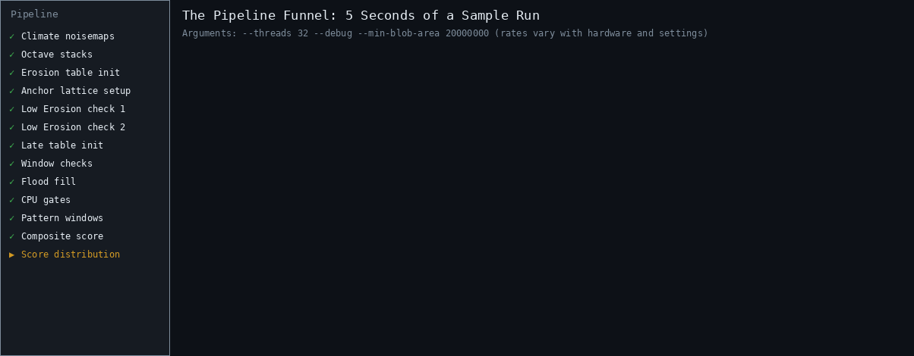
</p>

The bar lengths are logarithmic, by the way; on a linear scale, every bar below the second one would be invisible in the animation. That's how picky the filtering system is!

And finally, the animation below is a visual representation of over 700,000 seeds containing mountainous megaregions, compiled across several runs. The square corresponds to MRF's search square, centered on (0, 0) and spanning ±16,000 blocks along the X and Z axes. Every dot represents the coordinates of a megaregion's core; cooler-tone dots are low-scoring regions, while warmer-tone dots represent the high-scorers. Note that negative-scoring seeds have been omitted for brevity.

<p align="center">
  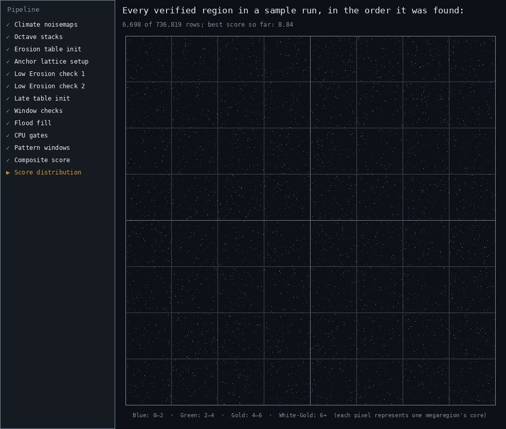
</p>

What's cool is how evenly distributed all the megaregions are, and how the vast majority are low-scorers. The few golden specks you see are the gems this whole program was built to uncover.


## License & Acknowledgements

MountainRangeFinder is released under the MIT License (see [LICENSE](LICENSE)).

[Cubiomes](https://github.com/Cubitect/cubiomes) by Cubitect is bundled in `cubiomes/` under the MIT License (see `cubiomes/LICENSE`).

Special thanks to ShowMe7, Jereaux, and others from the Minecraft@Home Discord server for creating [YouTube videos](https://www.youtube.com/watch?v=5-1c9gxK9ac) and documentation<sup>([1](https://docs.google.com/document/d/1AbK2dtr1I2gg_JxVqLy4AhZCc7LYu59iqvf7w0xCWMY/))</sup><sup>([2](https://docs.google.com/document/d/1lBmVo_vw_KNf_7nhnRladhRwfa-kXGaY8Zk0xi2WVnU/))</sup> that inspired this project. Their community's collaborative mushroom island seedfinder [COMMISSION](https://github.com/MinecraftAtHome/COMMISSION) deserves a special shoutout; it's an excellent proof of concept for how running hyper-optimized CUDA kernels on a GPU can speed up the seedfinding process by several orders of magnitude.

And last but not least, special thanks to Mojang, for making a really cool game that shaped my formative years.
